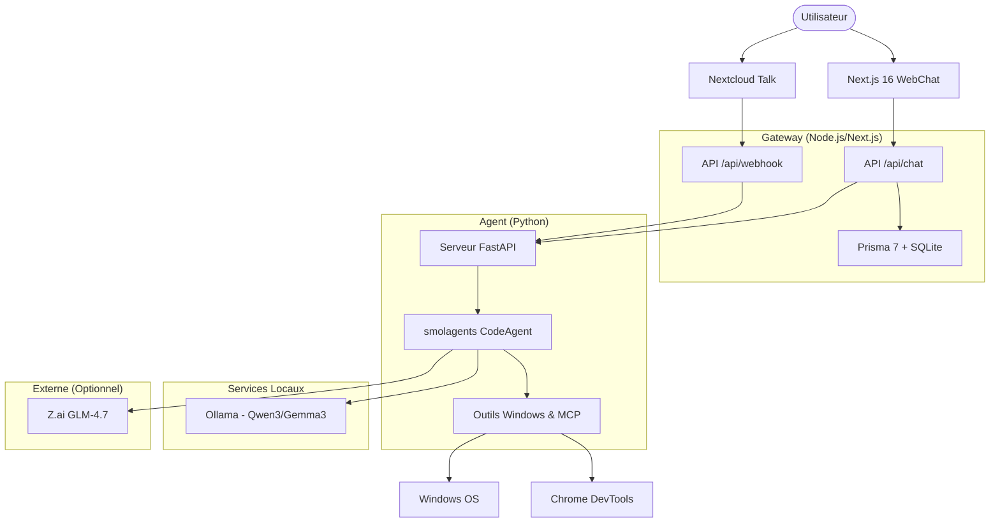

# my-claw 🦞

Un assistant personnel minimaliste, auto-hébergé et respectueux de la vie privée, conçu pour Windows.

**my-claw** est un assistant hybride puissant qui combine une interface moderne en Next.js 16 avec un "cerveau" Python propulsé par `smolagents`. Il est conçu pour fonctionner entièrement sur votre propre matériel, garantissant que vos données ne quittent jamais votre machine, sauf si vous choisissez explicitement d'utiliser des modèles cloud optionnels.

---

## ✨ Fonctionnalités Clés

- 🛡️ **Privacy-First** : Conçu pour fonctionner à 100% localement avec Ollama.
- 🪟 **Intégration Windows Profonde** : Accès complet au système de fichiers, à PowerShell, au presse-papier et à l'écran.
- 🧠 **Cerveau Hybride** : Utilise `smolagents` pour une utilisation intelligente des outils et l'exécution de code.
- 🌐 **Interface Web Moderne** : Interface propre et réactive construite avec Next.js 16 et Tailwind CSS.
- 🔌 **Outils Extensibles** : Supporte les outils Python personnalisés et les intégrations Model Context Protocol (MCP).
- 🤖 **Support Multi-Modèles** : Support natif pour Qwen3, Gemma3 et GLM-4.7 (via Z.ai).

---

## 🚀 Démarrage Rapide

### Prérequis

- **Node.js** : 24.x ou supérieur
- **uv** : [Gestionnaire de paquets Python](https://docs.astral.sh/uv/)
- **Ollama** : Pour l'accélération locale des LLM
- **Windows OS** : Recommandé (pour le support natif des outils)

### Installation

Le projet inclut un script d'installation automatique pour plus de commodité :

```powershell
./setup.ps1
```

Ce script va :
1. Initialiser l'environnement de la Gateway (Next.js) et ses dépendances.
2. Configurer l'environnement de l'Agent (Python) via `uv`.
3. Configurer la base de données SQLite avec Prisma 7.
4. Préparer vos fichiers `.env`.

---

## 🏗️ Architecture

Le système est divisé en deux composants principaux : la **Gateway** (gestion de l'UI et de la mémoire) et l'**Agent** (gestion du raisonnement et des outils).



---

## 🛠️ Capacités des Outils

Statut actuel : **6/10 outils cœurs implémentés**

| Outil | Statut | Description |
|-------|--------|-------------|
| **Système de fichiers** | ✅ | Lire, écrire, déplacer, supprimer et rechercher des fichiers sur Windows. |
| **Exécution OS** | ✅ | Exécuter des commandes et des scripts PowerShell. |
| **Presse-papier** | ✅ | Accéder et modifier le presse-papier Windows. |
| **Vision** | ✅ | Analyse d'images locale et OCR via `qwen3-vl:2b`. |
| **Capture d'écran** | ✅ | Capturer l'écran entier ou des régions spécifiques. |
| **Chrome DevTools** | ✅ | Automatisation complète du navigateur via MCP (Puppeteer). |
| **Souris & Clavier** | 🔄 | Contrôle direct des entrées OS (En cours). |
| **Recherche Web** | ⏳ | Recherche web en temps réel (Roadmap). |
| **Lecteur Web** | ⏳ | Extraction de contenu depuis des URLs (Roadmap). |
| **GitHub** | ⏳ | Analyse de dépôts et lecture de fichiers (Roadmap). |

---

## 📅 Roadmap

### Module 0 : Fondations ✅
- Structure du projet, Next.js 16, Python `uv`, et intégration Ollama.

### Module 1 : Cerveau Python ✅
- Intégration `smolagents`, serveur FastAPI, et interface de développement Gradio.

### Module 2 : Mémoire (Prisma 7) ✅
- Persistance SQLite pour les conversations et les paramètres.

### Module 3 : WebChat ✅
- Interface de streaming, SSE, et authentification sécurisée.

### Module 4 : Intégration Nextcloud Talk ⏳
- Support de bot via webhooks HMAC-SHA256 pour l'interaction mobile.

### Module 5 : Tâches Proactives ⏳
- Exécution de jobs basés sur cron et notifications proactives.

### Module 6 : Identité & Persona ⏳
- Prompts système personnalisables et réglages de la personnalité de l'assistant.

---

## 📚 Documentation

Pour des informations plus détaillées, veuillez vous référer aux fichiers suivants :

- 📊 [STATUS.md](STATUS.md) — Vue d'ensemble rapide du projet.
- 📋 [PROGRESS.md](PROGRESS.md) — Points d'avancement détaillés du développement.
- 🗺️ [PLAN.md](PLAN.md) — Architecture et objectifs à long terme.
- 🏗️ [AGENTS.md](AGENTS.md) — Guide technique pour les développeurs et agents.
- 🎯 [agent/SKILLS.md](agent/SKILLS.md) — Patterns de code spécifiques à l'agent.

---

## 🛠️ Stack Technique

- **Frontend** : Next.js 16, React, Tailwind CSS
- **Base de données** : SQLite avec Prisma 7
- **Framework Agent** : [smolagents](https://github.com/huggingface/smolagents)
- **API** : FastAPI (Python)
- **Environnement** : Node.js 24+, Python 3.11+ (via `uv`)
- **LLM** : Ollama (Local), Z.ai (Cloud/Optionnel)

---

## 📄 Licence

Ce projet est sous licence MIT - voir le fichier [LICENSE](LICENSE) pour plus de détails.

---

Construit avec 🦞 et 🐍 pour une meilleure expérience d'IA personnelle.
