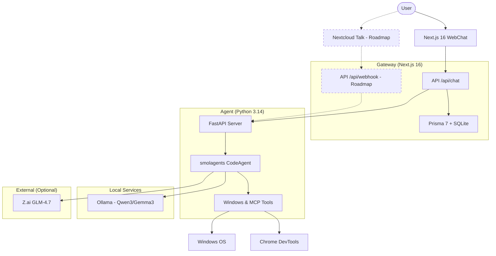

# my-claw 🦞

A minimalist, self-hosted, and privacy-first personal assistant designed for Windows.

**my-claw** is a powerful hybrid assistant that combines a modern Next.js 16 frontend with a Python-based "brain" powered by `smolagents`. It is built to run entirely on your own hardware, ensuring your data never leaves your machine unless you explicitly choose to use optional cloud models.

---

## ✨ Key Features

- 🛡️ **Privacy-First**: Designed to run 100% locally with Ollama.
- 🪟 **Deep Windows Integration**: Full access to file system, PowerShell, clipboard, and screen.
- 🧠 **Hybrid Brain**: Uses `smolagents` for intelligent tool use and code execution.
- 🌐 **Modern Web Interface**: Clean, responsive UI built with Next.js 16 and Tailwind CSS.
- 🔌 **Extensible Tools**: Supports custom Python tools and Model Context Protocol (MCP) integrations.
- 🤖 **Multi-Model Support**: Native support for Qwen3, Gemma3, and GLM-4.7 (via Z.ai).

---

## 🚀 Quick Start

### Prerequisites

- **Node.js**: 25.x or higher
- **uv**: [Python package manager](https://docs.astral.sh/uv/)
- **Python**: 3.14.x or higher
- **Ollama**: For local LLM acceleration
- **Windows OS**: Recommended (for native tool support)

### Installation

The project includes an automatic setup script for convenience:

```powershell
./setup.ps1
```

This script will:
1. Initialize Gateway (Next.js) environment and dependencies.
2. Setup Agent (Python) environment using `uv`.
3. Configure Prisma 7 SQLite database.
4. Prepare your `.env` files.

---

## 🏗️ Architecture

The system is split into two main components: **Gateway** (handling UI and memory) and **Agent** (handling reasoning and tools).



---

## ⚙️ Model Configuration

### Default Model

The default model for the manager and all sub-agents is **glm-4.7 (reason)** if `ZAI_API_KEY` is configured, otherwise **qwen3:8b** (local).

You can change the default model by setting the `DEFAULT_MODEL` environment variable in `agent/.env`:

```bash
# Use glm-4.7 (recommended)
DEFAULT_MODEL=reason

# Use glm-4.7-flash (faster)
DEFAULT_MODEL=coding

# Use qwen3:8b (local, free)
DEFAULT_MODEL=main
```

### Available Models

| Category | Model | Type | Description |
|----------|-------|------|-------------|
| reason | glm-4.7 | Cloud | Deep reasoning (default with API key) |
| code | glm-4.7-flash | Cloud | Fast coding |
| main | qwen3:8b | Local | Main model (default without API key) |
| vision | qwen3-vl:8b | Local | Local vision |
| smart | qwen3:14b / 8b | Local | Daily intelligent assistant (14b recommended) |
| fast | gemma3:4b / latest | Local | Ultra-fast responses |

### Intelligent Model Choice

The system automatically detects your hardware capabilities. For local usage:
- **High-end (16GB+ VRAM)**: Use `qwen3:14b` for `main` and `smart` tasks.
- **Mid-range (8GB VRAM)**: Use `qwen3:8b` for a balanced experience.
- **Low-end / Speed**: Use `gemma3:4b` or `Nanbeige4.1-3B` for near-instant responses.

### Configuration Z.ai (optional)

To use cloud-based GLM-4.7 models, configure your API key in `agent/.env`:

```bash
ZAI_API_KEY=sk-your-api-key
ZAI_BASE_URL=https://api.z.ai/api/coding/paas/v4
```

Without an API key, the system automatically falls back to local models (Qwen3).

---

## 🛠️ Tool Capabilities

Current status: **10/11 core tools implemented**

| Tool | Status | Description |
|------|--------|-------------|
| **File System** | ✅ | Read, write, move, delete, and search files on Windows. |
| **OS Exec** | ✅ | Execute PowerShell commands and scripts. |
| **Clipboard** | ✅ | Access and modify Windows clipboard. |
| **Web Search** | ✅ | Real-time web search via DuckDuckGo (unlimited). |
| **Web Reader** | ✅ | Content extraction and markdown conversion from URLs. |
| **Vision** | ✅ | Local image analysis and OCR via `qwen3-vl`. |
| **Screenshot** | ✅ | Capture full screen or specific regions. |
| **Mouse & Keyboard**| ✅ | Direct OS input control via pyautogui. |
| **GUI Grounding** | ✅ | UI element localization with qwen3-vl. |
| **Chrome DevTools**| ✅ | Full browser automation via MCP (Puppeteer). |
| **GitHub** | ⏳ | Repository analysis and file reading (Roadmap). |

---

## 📅 Roadmap

### Module 0: Foundation ✅
- Project structure, Next.js 16, Python `uv`, and Ollama integration.

### Module 1: Python Brain ✅
- `smolagents` integration, FastAPI server, and Gradio development UI.

### Module 2: Memory (Prisma 7) ✅
- SQLite persistence for conversations and settings.

### Module 3: WebChat ✅
- Streaming UI, SSE, and secure authentication.

### Module 4: Nextcloud Talk Integration ⏳
- Bot support via HMAC-SHA256 webhooks for mobile interaction.

### Module 5: Proactive Tasks ⏳
- Cron-based job execution and proactive notifications.

### Module 6: Identity & Persona ⏳
- Customizable system prompts and assistant personality settings.

---

## 📚 Documentation

For more detailed information, please refer to following files:

- 📊 [STATUS.md](STATUS.md) — Quick project overview.
- 📋 [PROGRESS.md](PROGRESS.md) — Detailed development checkpoints.
- 🗺️ [PLAN.md](PLAN.md) — Long-term architecture and goals.
- 🏗️ [AGENTS.md](AGENTS.md) — Technical guide for developers and agents.
- 🎯 [agent/SKILLS.md](agent/SKILLS.md) — Agent-specific code patterns.

---

## 🛠️ Tech Stack

- **Frontend**: Next.js 16.1, React 19, Tailwind CSS 4
- **Database**: SQLite with Prisma 7.4
- **Agent Framework**: [smolagents](https://github.com/huggingface/smolagents)
- **API**: FastAPI (Python)
- **Environment**: Node.js 25+, Python 3.14.2 (via `uv`)
- **LLM**: Ollama (Local), Z.ai (Cloud/Optional)

---

## 📄 License

This project is licensed under MIT License - see the [LICENSE](LICENSE) file for details.

---

Built with 🦞 and 🐍 for a better personal AI experience.
