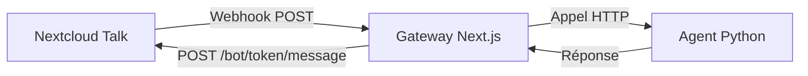

# Guide d'Installation et Configuration - Nextcloud Talk Bot

Ce guide détaille l'installation complète du bot Nextcloud Talk pour my-claw, incluant la configuration réseau et le pare-feu Windows.

## Architecture



## Prérequis

- Nextcloud Talk avec support bots-v1 (Nextcloud 27.1+ / Talk 17.1+)
- my-claw installé et configuré
- Accès SSH au serveur Nextcloud
- Réseau local entre la machine my-claw et le serveur Nextcloud

---

## 1. Configuration de la Gateway my-claw

### 1.1 Variables d'environnement

Ajoutez dans **`gateway/.env.local`** :

```bash
# Nextcloud Talk Bot
NC_TALK_BASE_URL="https://your-nextcloud.example.com"
NC_TALK_BOT_SECRET="votre_secret_genere_avec_openssl"
```

> **Note** : Pas besoin de `NC_TALK_BOT_TOKEN`. Le token de conversation est fourni dynamiquement dans chaque webhook.

### 1.2 Génération du secret

```bash
openssl rand -hex 64
```

Le secret doit contenir entre 40 et 128 caractères.

---

## 2. Configuration Réseau

### 2.1 Pare-feu Windows

Ouvrez le port 3000 sur la machine Windows où tourne la Gateway :

```powershell
# Ouvrir PowerShell en administrateur
New-NetFirewallRule -DisplayName "My-Claw Gateway" -Direction Inbound -LocalPort 3000 -Protocol TCP -Action Allow
```

Ouvrez aussi le port 8000 pour l'Agent (optionnel, pour tests) :

```powershell
New-NetFirewallRule -DisplayName "My-Claw Agent" -Direction Inbound -LocalPort 8000 -Protocol TCP -Action Allow
```

### 2.2 Configuration DNS local (optionnel)

Sur le serveur Nextcloud, ajoutez une entrée dans `/etc/hosts` :

```bash
sudo nano /etc/hosts
```

Ajoutez :
```
192.168.1.XX    myclaw.local
```

Remplacez `192.168.1.XX` par l'IP locale de votre machine Windows.

### 2.3 Vérification de la connectivité

Depuis le serveur Nextcloud, testez la connexion :

```bash
curl -v http://192.168.1.XX:3000/api/nc-talk
```

Vous devriez voir `HTTP/1.1 405 Method Not Allowed` (normal pour un GET sur un endpoint POST).

---

## 3. Installation du Bot sur Nextcloud

### 3.1 Connexion SSH

```bash
ssh utilisateur@votre-serveur-nextcloud
cd /var/www/html/nextcloud/
```

### 3.2 Installation du bot

```bash
sudo -u apache php occ talk:bot:install \
  --feature webhook \
  --feature response \
  "My-Claw Bot" \
  "VOTRE_SECRET_GENERE" \
  "http://192.168.1.XX:3000/api/nc-talk" \
  "Assistant personnel my-claw"
```

> **Important** : Utilisez le même secret que dans `gateway/.env.local`.

### 3.3 Vérification

```bash
sudo -u apache php occ talk:bot:list
```

Résultat attendu :
```
+----+-------------+-----------------------------+-------------+-------+-------------------+
| id | name        | description                 | error_count | state | features          |
+----+-------------+-----------------------------+-------------+-------+-------------------+
| 2  | My-Claw Bot | Assistant personnel my-claw | 0           | 1     | webhook, response |
+----+-------------+-----------------------------+-------------+-------+-------------------+
```

### 3.4 Ajout à une conversation

Récupérez le token de la conversation depuis l'URL :
- URL : `https://nextcloud.example.com/index.php/call/abc12345`
- Token : `abc12345`

```bash
sudo -u apache php occ talk:bot:setup 2 abc12345
```

---

## 4. Démarrage des Services

### 4.1 Terminal 1 - Gateway

```bash
cd gateway
npm run dev -- -H 0.0.0.0
```

> **Important** : L'option `-H 0.0.0.0` est nécessaire pour que Next.js écoute sur toutes les interfaces.

### 4.2 Terminal 2 - Agent

```bash
cd agent
uv run uvicorn main:app --reload --host 0.0.0.0
```

---

## 5. Test

1. Ouvrez Nextcloud Talk dans votre navigateur
2. Allez dans la conversation où le bot est ajouté
3. Envoyez un message
4. Le bot devrait répondre automatiquement

### Vérification des logs

**Gateway** :
```
[NC-Webhook] Activité reçue: Create
[NC-Webhook] Appel de l'agent pour: abc12345
[NC-Webhook] Réponse envoyée à Nextcloud pour: abc12345
```

---

## 6. Dépannage

### Erreur 401 Unauthorized

**Cause** : Signature HMAC incorrecte

**Solution** : Vérifiez que le secret dans `gateway/.env.local` correspond exactement à celui utilisé lors de l'installation du bot.

### Aucune requête reçue

**Causes possibles** :
1. Pare-feu Windows bloque le port 3000
2. Next.js n'écoute pas sur `0.0.0.0`
3. URL du bot incorrecte dans Nextcloud

**Solutions** :
```powershell
# Vérifier la règle de pare-feu
Get-NetFirewallRule -DisplayName "My-Claw Gateway"

# Tester depuis le serveur Nextcloud
curl -X POST http://192.168.1.XX:3000/api/nc-talk -H "Content-Type: application/json" -d '{"test":"test"}'
```

### Erreur "Invalid signature"

**Cause** : Le webhook reçoit la requête mais la signature ne correspond pas.

**Solution** : Vérifiez le secret et régénérez-le si nécessaire.

---

## 7. Commandes OCC Utiles

```bash
# Lister les bots
sudo -u apache php occ talk:bot:list

# Voir les détails d'un bot
sudo -u apache php occ talk:bot:list --output=json

# Ajouter un bot à une conversation
sudo -u apache php occ talk:bot:setup <BOT_ID> <CONVERSATION_TOKEN>

# Retirer un bot d'une conversation
sudo -u apache php occ talk:bot:remove <BOT_ID> <CONVERSATION_TOKEN>

# Désinstaller un bot
sudo -u apache php occ talk:bot:uninstall <BOT_ID>

# Changer l'état d'un bot (0=disabled, 1=enabled, 2=no-setup)
sudo -u apache php occ talk:bot:state <BOT_ID> <STATE>
```

---

## 8. Fichiers Modifiés

| Fichier | Description |
|---------|-------------|
| `gateway/lib/nc-security.ts` | Vérification et signature HMAC-SHA256 |
| `gateway/lib/nc-client.ts` | Client API pour envoyer des messages |
| `gateway/app/api/nc-talk/route.ts` | Endpoint webhook |
| `gateway/.env.example` | Variables d'environnement |
| `gateway/.env.local` | Configuration locale (à créer) |

---

## 9. Références

- [Documentation Nextcloud Talk Bots](https://nextcloud-talk.readthedocs.io/en/latest/bots/)
- [Documentation OCC Nextcloud Talk](https://nextcloud-talk.readthedocs.io/en/latest/occ/)
