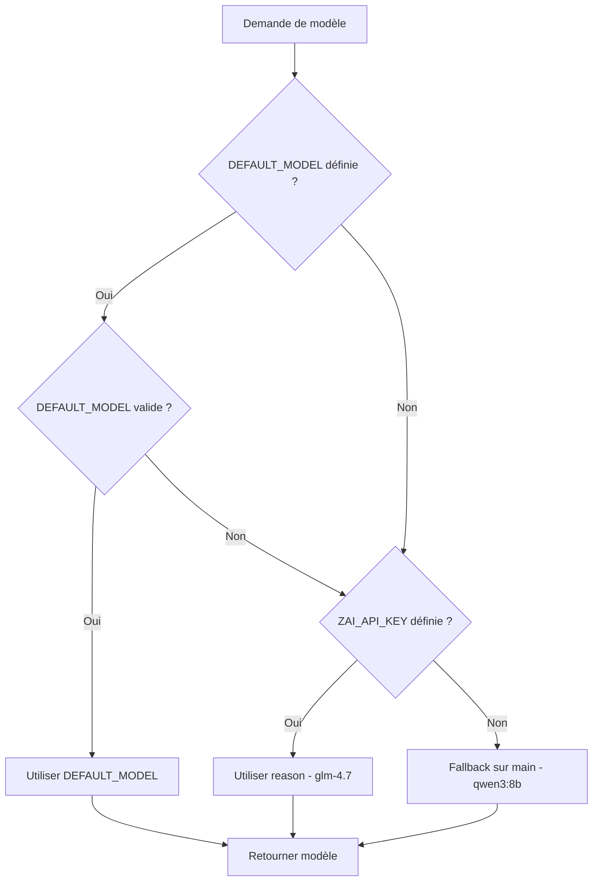

# Plan : Configurer GLM4.7 comme modèle par défaut

## Objectif

Mettre par défaut **glm-4.7 (reason)** comme modèle pour le manager et les sous-agents, avec fallback intelligent sur les modèles locaux (qwen3:8b) si GLM4.7 n'est pas disponible.

---

## État actuel

### Modèles disponibles

| Catégorie | Modèle actuel | Type | Usage |
|-----------|---------------|------|-------|
| `code` | glm-4.7-flash | Cloud | Coding rapide |
| `reason` | glm-4.7 | Cloud | Raisonnement profond |
| `fast` | gemma3:latest | Local | Réponses rapides |
| `smart` | qwen3:8b | Local | Usage quotidien |
| `main` | qwen3:8b | Local | Modèle principal |
| `vision` | qwen3-vl:8b | Local | Vision locale |

### Sous-agents actuels

| Agent | Modèle actuel | Commentaire |
|-------|---------------|-------------|
| Manager | `model_id` paramètre | Utilise le modèle passé en paramètre |
| pc_control_agent | `qwen3:8b` (hardcodé) | Ligne 275 dans main.py |
| vision_agent | `qwen3:8b` (hardcodé) | Ligne 286 dans main.py |
| browser_agent | `qwen3:8b` (hardcodé) | Ligne 297 dans main.py |
| web_agent | `qwen3:8b` (hardcodé) | Ligne 309 dans main.py |

### Problème identifié

Les modèles des sous-agents sont codés en dur dans [`main.py`](agent/main.py:275) avec `"qwen3:8b"`, ce qui empêche d'utiliser GLM4.7 par défaut même si `ZAI_API_KEY` est configuré.

---

## Architecture proposée

### 1. Ajouter une catégorie "coding" pour GLM4.7-flash

Dans [`main.py`](agent/main.py:58-61), ajouter une nouvelle catégorie :

```python
CLOUD_MODELS: dict[str, tuple[str, str]] = {
    "code":   ("openai/glm-4.7-flash", os.environ.get("ZAI_BASE_URL", "https://api.z.ai/api/coding/paas/v4")),
    "reason": ("openai/glm-4.7",       os.environ.get("ZAI_BASE_URL", "https://api.z.ai/api/coding/paas/v4")),
    "coding": ("openai/glm-4.7-flash", os.environ.get("ZAI_BASE_URL", "https://api.z.ai/api/coding/paas/v4")),  # ← NOUVEAU
}
```

### 2. Variable d'environnement pour le modèle par défaut

Ajouter dans [`agent/.env.example`](agent/.env.example) :

```bash
# Modèle par défaut pour le manager et les sous-agents
# Options : main (qwen3:8b local), coding (glm-4.7-flash cloud), reason (glm-4.7 cloud)
DEFAULT_MODEL=reason
```

### 3. Fonction utilitaire pour le modèle par défaut

Dans [`main.py`](agent/main.py), ajouter après la définition de `get_model()` :

```python
def get_default_model() -> str:
    """
    Retourne le modèle par défaut pour le manager et les sous-agents.

    Priorité :
    1. Variable d'environnement DEFAULT_MODEL
    2. "reason" (glm-4.7) si ZAI_API_KEY configuré
    3. "main" (qwen3:8b local) en fallback

    Returns:
        str: Identifiant du modèle par défaut (main, coding, reason, smart, fast, vision)
    """
    # Priorité 1 : variable d'environnement
    env_default = os.environ.get("DEFAULT_MODEL")
    if env_default and env_default in MODELS:
        logger.info(f"✓ Modèle par défaut depuis env: {env_default}")
        return env_default

    # Priorité 2 : GLM4.7 si API key configuré
    if os.environ.get("ZAI_API_KEY"):
        logger.info("✓ Modèle par défaut: reason (glm-4.7)")
        return "reason"

    # Priorité 3 : fallback local
    logger.info("✓ Modèle par défaut: main (qwen3:8b local)")
    return "main"
```

### 4. Modifier `build_multi_agent_system` pour utiliser le modèle par défaut

Dans [`main.py`](agent/main.py:250-336), modifier la fonction :

```python
def build_multi_agent_system(model_id: str | None = None) -> CodeAgent:
    """
    Construit le système Manager + sous-agents selon les tools disponibles.

    Architecture :
    - Manager : modèle par défaut (coding → main) + tools directs (file_system, os_exec, clipboard)
    - pc_control : modèle par défaut + screenshot, ui_grounding, mouse_keyboard
    - vision : modèle par défaut + analyze_image
    - browser : modèle par défaut + Chrome DevTools MCP (si disponible)
    - web_search : modèle par défaut + MCP Z.ai (si ZAI_API_KEY configuré)

    NOTE : Tous les agents sauf vision_agent utilisent le même modèle LLM.
    Les outils spécialisés (ui_grounding, analyze_image) utilisent leurs propres modèles internes.

    Args:
        model_id: Modèle spécifique (optionnel, utilise le défaut sinon)

    Returns:
        CodeAgent: Le manager avec ses sous-agents
    """
    from agents.pc_control_agent import create_pc_control_agent
    from agents.vision_agent import create_vision_agent
    from agents.browser_agent import create_browser_agent
    from agents.web_agent import create_web_agent

    ollama_url = os.environ.get("OLLAMA_BASE_URL", "http://localhost:11434")
    managed_agents = []

    # Déterminer le modèle à utiliser
    if model_id is None:
        model_id = get_default_model()

    logger.info(f"Modèle sélectionné pour tous les agents: {model_id}")

    # ── Sous-agent pilotage PC ────────────────────────────────────────────────
    try:
        pc_agent = create_pc_control_agent(ollama_url, model_id=model_id)
        managed_agents.append(pc_agent)
        logger.info(f"✓ pc_control_agent créé avec modèle {model_id}")
    except Exception as e:
        logger.warning(f"✗ pc_control_agent non disponible: {e}")

    # ── Sous-agent vision ────────────────────────────────────────────────────
    try:
        vision_agent = create_vision_agent(ollama_url, model_id=model_id)
        managed_agents.append(vision_agent)
        logger.info(f"✓ vision_agent créé avec modèle {model_id}")
    except Exception as e:
        logger.warning(f"✗ vision_agent non disponible: {e}")

    # ── Sous-agent browser Chrome ─────────────────────────────────────────────
    if _chrome_mcp_tools:
        try:
            browser_agent = create_browser_agent(ollama_url, _chrome_mcp_tools, model_id=model_id)
            managed_agents.append(browser_agent)
            logger.info(f"✓ browser_agent créé ({len(_chrome_mcp_tools)} tools Chrome DevTools) avec modèle {model_id}")
        except Exception as e:
            logger.warning(f"✗ browser_agent non disponible: {e}")
    else:
        logger.warning("✗ browser_agent ignoré (Chrome DevTools MCP non disponible)")

    # ── Sous-agent web search Z.ai ────────────────────────────────────────────
    if _web_search_tools:
        try:
            web_agent = create_web_agent(ollama_url, _web_search_tools, model_id=model_id)
            if web_agent:
                managed_agents.append(web_agent)
                logger.info(f"✓ web_agent créé ({len(_web_search_tools)} tools Z.ai) avec modèle {model_id}")
        except Exception as e:
            logger.warning(f"✗ web_agent non disponible: {e}")
    else:
        logger.info("✗ web_agent ignoré (aucun tool MCP Z.ai)")

    # ── Manager ───────────────────────────────────────────────────────────────
    manager_tools = get_manager_tools()
    logger.info(f"Manager tools directs: {[t.name for t in manager_tools]}")
    logger.info(f"Sous-agents disponibles: {[m.name for m in managed_agents]}")

    manager = CodeAgent(
        tools=manager_tools,
        model=get_model(model_id),
        managed_agents=managed_agents,
        max_steps=10,
        verbosity_level=2,
        additional_authorized_imports=[
            "requests", "urllib", "json", "csv", "pathlib", "os", "subprocess",
        ],
        executor_kwargs={"timeout_seconds": 240},
        instructions=SKILLS,
    )

    return manager
```

### 5. Mettre à jour les fonctions de création de sous-agents

Les fonctions dans [`agents/`](agent/agents/) n'ont pas besoin d'être modifiées car elles acceptent déjà un paramètre `model_id` :

- [`pc_control_agent.py`](agent/agents/pc_control_agent.py:44) : `create_pc_control_agent(ollama_url, model_id="qwen3:8b")`
- [`vision_agent.py`](agent/agents/vision_agent.py:49) : `create_vision_agent(ollama_url, model_id="qwen3:8b")`
- [`browser_agent.py`](agent/agents/browser_agent.py:36) : `create_browser_agent(ollama_url, mcp_tools, model_id="qwen3:8b")`
- [`web_agent.py`](agent/agents/web_agent.py:33) : `create_web_agent(ollama_url, web_search_tools, model_id="qwen3:8b")`

Seuls les appels dans [`main.py`](agent/main.py) doivent être modifiés pour utiliser `model_id` au lieu de `"qwen3:8b"`.

### 6. Mettre à jour l'endpoint `/models`

Dans [`main.py`](agent/main.py:379-400), mettre à jour la réponse pour refléter le nouveau modèle par défaut :

```python
@app.get("/models")
async def list_models():
    default_model = get_default_model()
    models_info = {}
    for category, (model_name, base_url) in MODELS.items():
        display_name = model_name.split("/")[-1] if "/" in model_name else model_name
        is_local = "ollama_chat/" in model_name or "localhost" in base_url
        is_default = category == default_model
        models_info[category] = {
            "name": display_name,
            "full_name": model_name,
            "type": "local" if is_local else "cloud",
            "available": True,
            "is_default": is_default,
        }
    return {
        "default_model": default_model,
        "models": models_info,
        "ollama_models": get_ollama_models(),
        "sub_agents": {
            "pc_control": f"{default_model} + qwen3-vl (interne)",
            "vision": f"{default_model} + analyze_image (qwen3-vl interne)",
            "browser": f"{default_model} + {len(_chrome_mcp_tools)} tools Chrome DevTools",
            "web_search": f"{default_model} + {len(_web_search_tools)} tools Z.ai MCP",
        },
    }
```

---

## Diagramme de flux de sélection du modèle



---

## Liste des fichiers à modifier

| Fichier | Modifications |
|---------|---------------|
| [`agent/main.py`](agent/main.py) | - Ajouter fonction get_default_model()<br>- Modifier build_multi_agent_system()<br>- Mettre à jour l'endpoint /models |
| [`agent/.env.example`](agent/.env.example) | - Ajouter DEFAULT_MODEL=reason |
| [`agent/.env`](agent/.env) | - Ajouter DEFAULT_MODEL=reason (si existe) |
| [`AGENTS.md`](AGENTS.md) | - Mettre à jour la section MODÈLES LLM<br>- Documenter DEFAULT_MODEL |
| [`README.md`](README.md) | - Mettre à jour la configuration des modèles |

---

## Tests à effectuer

### Test 1 : Sans ZAI_API_KEY (mode local)
- Résultat attendu : Utilise `main` (qwen3:8b local)
- Vérifier les logs : "✓ Modèle par défaut: main (qwen3:8b local)"

### Test 2 : Avec ZAI_API_KEY mais sans DEFAULT_MODEL
- Résultat attendu : Utilise `reason` (glm-4.7)
- Vérifier les logs : "✓ Modèle par défaut: reason (glm-4.7)"

### Test 3 : Avec DEFAULT_MODEL=coding
- Résultat attendu : Utilise `coding` (glm-4.7-flash)
- Vérifier les logs : "✓ Modèle par défaut depuis env: coding"

### Test 4 : Avec DEFAULT_MODEL invalide
- Résultat attendu : Fallback sur `coding` ou `main`
- Vérifier les logs : Message d'avertissement

### Test 5 : Vérifier que tous les sous-agents utilisent le même modèle
- Résultat attendu : Tous les logs montrent le même modèle
- Vérifier : pc_control_agent, vision_agent, browser_agent, web_agent

---

## Comportement attendu

### Scénario 1 : Nouvelle installation avec ZAI_API_KEY
```
ZAI_API_KEY=sk-xxx
DEFAULT_MODEL=reason
```
→ Tous les agents utilisent glm-4.7

### Scénario 2 : Nouvelle installation sans ZAI_API_KEY
```
ZAI_API_KEY=
DEFAULT_MODEL=
```
→ Tous les agents utilisent qwen3:8b (local)

### Scénario 3 : Utilisateur veut forcer le modèle local
```
ZAI_API_KEY=sk-xxx
DEFAULT_MODEL=main
```
→ Tous les agents utilisent qwen3:8b (local)

### Scénario 4 : Utilisateur veut le modèle de coding rapide
```
ZAI_API_KEY=sk-xxx
DEFAULT_MODEL=coding
```
→ Tous les agents utilisent glm-4.7-flash

---

## Avantages de cette approche

1. **Flexibilité** : L'utilisateur peut choisir son modèle via une variable d'environnement
2. **Fallback intelligent** : Utilise automatiquement le modèle local si GLM4.7 n'est pas disponible
3. **Compatibilité ascendante** : Fonctionne sans modification de configuration existante
4. **Cohérence** : Tous les agents utilisent le même modèle par défaut
5. **Logging clair** : Les logs indiquent clairement quel modèle est utilisé

---

## Mise à jour de la documentation

### AGENTS.md

Mettre à jour la section **MODÈLES LLM** :

```markdown
## MODÈLES LLM

### Ollama — 100% local, 0 donnée sortante

| ID | Modèle | Taille | Usage |
|----|--------|--------|-------|
| fast | gemma3:latest | 3.3GB | Réponses rapides |
| smart | qwen3:8b | 5.2GB | Usage quotidien — recommandé |
| main | qwen3:8b | 5.2GB | Modèle principal — défaut sans ZAI_API_KEY |
| vision | qwen3-vl:8b | 5.2GB | Vision locale (TOOL-7, interne à analyze_image) |

### Z.ai — Cloud (données envoyées à Z.ai)

| ID | Modèle | Usage |
|----|--------|-------|
| code | glm-4.7-flash | Code, tâches techniques rapides |
| reason | glm-4.7 | Raisonnement profond — défaut avec ZAI_API_KEY |

### Configuration du modèle par défaut

Le modèle par défaut pour le manager et tous les sous-agents est déterminé par la fonction `get_default_model()` avec la priorité suivante :

1. **Variable d'environnement `DEFAULT_MODEL`** : Si définie et valide
2. **`reason` (glm-4.7)** : Si `ZAI_API_KEY` est configuré
3. **`main` (qwen3:8b)** : Fallback local

Exemples de configuration dans `agent/.env` :

```bash
# Utiliser glm-4.7 par défaut (recommandé pour le raisonnement)
DEFAULT_MODEL=reason

# Utiliser glm-4.7-flash pour le coding rapide
DEFAULT_MODEL=coding

# Forcer le modèle local (gratuit)
DEFAULT_MODEL=main
```

### Règles modèles

- Modèle par défaut : `reason` (glm-4.7) si ZAI_API_KEY configuré, sinon `main` (qwen3:8b)
- **Détection automatique** : L'agent détecte les modèles Ollama installés au démarrage via `GET /api/tags`
- **Préférences par catégorie** : Chaque catégorie (fast/smart/main/vision) a une liste de modèles préférés
- **Fallback intelligent** : Si le modèle préféré n'est pas installé, utilise le suivant dans la liste
- Si ZAI_API_KEY absent : fallback silencieux sur main
- think: false en mode agent (évite verbosité Qwen3)
- num_ctx: 32768 pour tous les modèles Ollama
- max_steps=5 pour tâches simples, 10 pour pilotage PC complexe
- Provider Ollama : LiteLLMModel avec prefix ollama_chat/
- Provider Z.ai : LiteLLMModel avec prefix openai/ (compatible OpenAI)
- TOOL-7 (analyze_image) : utilise qwen3-vl:8b en local via Ollama (interne à l'outil)
- vision_agent : utilise glm-4.7 ou qwen3:8b comme LLM, qwen3-vl:8b en interne pour la vision
- **API `/models`** : Endpoint pour récupérer la liste des modèles disponibles
```

### README.md

Ajouter une section **Configuration des modèles** :

```markdown
## Configuration des modèles

### Modèle par défaut

Le modèle par défaut pour le manager et tous les sous-agents est **glm-4.7 (reason)** si `ZAI_API_KEY` est configuré, sinon **qwen3:8b** (local).

Vous pouvez changer le modèle par défaut en définissant la variable d'environnement `DEFAULT_MODEL` dans `agent/.env` :

```bash
# Utiliser glm-4.7 (recommandé)
DEFAULT_MODEL=reason

# Utiliser glm-4.7-flash (plus rapide)
DEFAULT_MODEL=coding

# Utiliser qwen3:8b (local, gratuit)
DEFAULT_MODEL=main
```

### Modèles disponibles

| Catégorie | Modèle | Type | Description |
|-----------|--------|------|-------------|
| reason | glm-4.7 | Cloud | Raisonnement profond (défaut avec API key) |
| code | glm-4.7-flash | Cloud | Coding rapide |
| main | qwen3:8b | Local | Modèle principal (défaut sans API key) |
| vision | qwen3-vl:8b | Local | Vision locale |
| smart | qwen3:8b | Local | Usage quotidien |
| fast | gemma3:latest | Local | Réponses rapides |

### Configuration Z.ai (optionnel)

Pour utiliser les modèles cloud GLM-4.7, configurez votre clé API dans `agent/.env` :

```bash
ZAI_API_KEY=sk-your-api-key
ZAI_BASE_URL=https://api.z.ai/api/coding/paas/v4
```

Sans clé API, le système utilise automatiquement les modèles locaux (qwen3:8b, qwen3-vl:8b).
```
```
