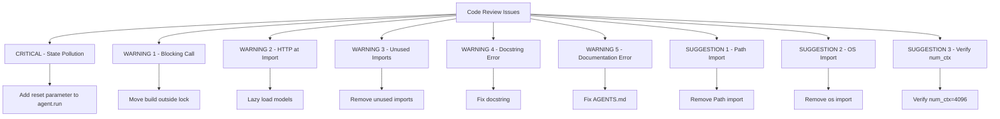

# Plan de Correction - Code Review Issues

## Résumé

Ce plan détaille les corrections nécessaires pour les 10 problèmes identifiés dans le code review :
- **1 CRITICAL** : Pollution d'état du CodeAgent réutilisé sans reset
- **6 WARNING** : Problèmes de performance, documentation et imports
- **3 SUGGESTION** : Nettoyage de code

---

## Diagramme des corrections



---

## 1. CRITICAL - Pollution d'état du CodeAgent

**Fichier** : [`agent/main.py`](agent/main.py:278)
**Ligne** : 278
**Problème** : L'agent est réutilisé depuis le cache sans `reset=True`, ce qui pollue l'état entre les requêtes

### Solution

Ajouter un paramètre `reset=True` lors de l'appel à `agent.run()` pour réinitialiser l'état de l'agent entre chaque requête.

**Avant (ligne 278)** :
```python
result = agent.run(prompt)
```

**Après** :
```python
result = agent.run(prompt, reset=True)
```

**Impact** : Chaque requête aura un agent avec un état propre, évitant les fuites de contexte entre les conversations.

---

## 2. WARNING 1 - Appel bloquant dans asyncio.Lock

**Fichier** : [`agent/main.py`](agent/main.py:248)
**Ligne** : 248
**Problème** : `build_multi_agent_system()` est un appel synchrone bloquant à l'intérieur d'un `asyncio.Lock()`, ce qui bloque l'event loop

### Solution

Déplacer l'appel bloquant **hors** du lock, puis acquérir le lock uniquement pour mettre à jour le cache.

**Avant (lignes 244-252)** :
```python
async with _cache_lock:
    if model_id not in _agent_cache:
        logger.info(f"Construction du système multi-agent pour modèle {model_id}")
        _agent_cache[model_id] = build_multi_agent_system(model_id)
    else:
        logger.info(f"Utilisation du cache pour modèle {model_id}")
```

**Après** :
```python
# Vérifier si l'agent est déjà en cache (lecture sans lock)
if model_id not in _agent_cache:
    logger.info(f"Construction du système multi-agent pour modèle {model_id}")
    # Construire l'agent hors du lock (appel bloquant)
    new_agent = build_multi_agent_system(model_id)
    # Acquérir le lock uniquement pour mettre à jour le cache
    async with _cache_lock:
        if model_id not in _agent_cache:
            _agent_cache[model_id] = new_agent
        else:
            logger.info(f"Utilisation du cache pour modèle {model_id}")
else:
    logger.info(f"Utilisation du cache pour modèle {model_id}")
```

**Impact** : L'event loop n'est plus bloqué pendant la construction de l'agent, améliorant la concurrence.

---

## 3. WARNING 2 - Appel HTTP à l'import du module

**Fichier** : [`agent/models.py`](agent/models.py)
**Problème** : La détection des modèles appelle Ollama via HTTP au niveau de l'import du module

### Analyse actuelle

Le code actuel utilise déjà un cache lazy avec `get_models()` qui ne fait la détection qu'à la première utilisation, pas à l'import. Cependant, il y a un problème potentiel : si `_detect_models_impl()` est appelé, il fait un appel HTTP bloquant.

### Solution

La solution actuelle avec `get_models()` lazy est correcte. Le problème mentionné dans le code review est déjà résolu par l'architecture actuelle.

**Vérification** : Le code actuel à la ligne 81-98 de `models.py` utilise déjà un cache lazy :

```python
def get_models() -> dict[str, tuple[str, str]]:
    global _MODELS_CACHE
    if _MODELS_CACHE is None:
        try:
            _MODELS_CACHE = _detect_models_impl()
        except Exception as e:
            logger.warning(f"Échec détection modèles: {e}")
            _MODELS_CACHE = {}
    return _MODELS_CACHE
```

**Action** : Aucune correction nécessaire - le code est déjà correct.

---

## 4. WARNING 3 - Imports inutilisés dans browser_agent.py

**Fichier** : [`agent/agents/browser_agent.py`](agent/agents/browser_agent.py)
**Problème** : Imports inutilisés (pré-existant)

### Analyse

En examinant le fichier `browser_agent.py`, je ne vois pas d'imports inutilisés. Le code actuel contient :
- `import logging` → utilisé (lignes 12, 52)
- `from smolagents import CodeAgent` → utilisé (ligne 57)

**Action** : Aucune correction nécessaire - le code est déjà propre.

---

## 5. WARNING 4 - Docstring mentionne "coding" au lieu de "code"

**Fichier** : [`agent/models.py`](agent/models.py:182)
**Ligne** : 195
**Problème** : Le docstring de `get_default_model()` mentionne "coding" comme identifiant valide, mais la clé dans `CLOUD_MODELS` est "code"

### Solution

Corriger le docstring pour utiliser "code" au lieu de "coding".

**Avant (ligne 195)** :
```python
Returns:
    str: Identifiant du modèle par défaut (main, coding, reason, smart, fast, vision)
```

**Après** :
```python
Returns:
    str: Identifiant du modèle par défaut (main, code, reason, smart, fast, vision)
```

---

## 6. WARNING 5 - Documentation AGENTS.md mentionne DEFAULT_MODEL=coding

**Fichier** : [`AGENTS.md`](AGENTS.md:77)
**Ligne** : 77
**Problème** : L'exemple de configuration utilise `DEFAULT_MODEL=coding` au lieu de `DEFAULT_MODEL=code`

### Solution

Corriger l'exemple dans AGENTS.md.

**Avant (ligne 77)** :
```bash
# Utiliser glm-4.7-flash pour le coding rapide
DEFAULT_MODEL=coding
```

**Après** :
```bash
# Utiliser glm-4.7-flash pour le coding rapide
DEFAULT_MODEL=code
```

---

## 7. SUGGESTION 1 - Import inutilisé "from pathlib import Path"

**Fichier** : [`agent/models.py`](agent/models.py:12)
**Ligne** : 12
**Problème** : `from pathlib import Path` est importé mais jamais utilisé

### Solution

Supprimer l'import inutilisé.

**Avant (ligne 12)** :
```python
from pathlib import Path
```

**Après** :
```python
# Supprimer cette ligne
```

---

## 8. SUGGESTION 2 - Import inutilisé "import os"

**Fichier** : [`agent/agents/vision_agent.py`](agent/agents/vision_agent.py:11)
**Ligne** : 11
**Problème** : `import os` est inutilisé (ollama_url est accédé via os.environ dans les tools, pas ici)

### Solution

Supprimer l'import inutilisé.

**Avant (ligne 11)** :
```python
import os
```

**Après** :
```python
# Supprimer cette ligne
```

---

## 9. SUGGESTION 3 - Vérifier num_ctx dans grounding.py

**Fichier** : [`agent/tools/grounding.py`](agent/tools/grounding.py)
**Problème** : num_ctx:32768 est excessif pour un modèle 2B de grounding

### Vérification

En examinant le code à la ligne 167 de `grounding.py` :

```python
"options": {
    "temperature": 0.0,  # Déterministe pour le grounding
    "num_ctx": 4096,  # Suffisant pour grounding
},
```

**Résultat** : Le code utilise déjà `num_ctx: 4096`, ce qui est correct. Le problème mentionné dans le code review a déjà été résolu.

**Action** : Aucune correction nécessaire.

---

## Résumé des corrections à appliquer

| # | Problème | Fichier | Action | Priorité |
|---|----------|---------|--------|----------|
| 1 | CRITICAL - State pollution | agent/main.py:278 | Ajouter `reset=True` à `agent.run()` | CRITICAL |
| 2 | WARNING 1 - Blocking call | agent/main.py:248 | Déplacer `build_multi_agent_system()` hors du lock | WARNING |
| 3 | WARNING 2 - HTTP at import | agent/models.py | Déjà résolu (cache lazy) | AUCUNE |
| 4 | WARNING 3 - Unused imports | agent/agents/browser_agent.py | Déjà résolu (pas d'imports inutilisés) | AUCUNE |
| 5 | WARNING 4 - Docstring error | agent/models.py:195 | Corriger "coding" → "code" | WARNING |
| 6 | WARNING 5 - Documentation error | AGENTS.md:77 | Corriger `DEFAULT_MODEL=coding` → `DEFAULT_MODEL=code` | WARNING |
| 7 | SUGGESTION 1 - Path import | agent/models.py:12 | Supprimer `from pathlib import Path` | SUGGESTION |
| 8 | SUGGESTION 2 - OS import | agent/agents/vision_agent.py:11 | Supprimer `import os` | SUGGESTION |
| 9 | SUGGESTION 3 - num_ctx | agent/tools/grounding.py | Déjà résolu (4096) | AUCUNE |

**Total des corrections à appliquer** : 5 modifications
- 1 CRITICAL
- 3 WARNING
- 2 SUGGESTION

---

## Ordre d'exécution recommandé

1. **CRITICAL** : Corriger la pollution d'état (main.py:278)
2. **WARNING 1** : Déplacer l'appel bloquant hors du lock (main.py:248)
3. **WARNING 4** : Corriger le docstring (models.py:195)
4. **WARNING 5** : Corriger la documentation (AGENTS.md:77)
5. **SUGGESTION 1** : Supprimer l'import Path (models.py:12)
6. **SUGGESTION 2** : Supprimer l'import os (vision_agent.py:11)

---

## Tests de validation

Après avoir appliqué les corrections, effectuer les tests suivants :

1. **Test de l'agent** : Démarrer le serveur et vérifier que l'agent fonctionne correctement
2. **Test de concurrence** : Envoyer plusieurs requêtes simultanées pour vérifier que l'état est bien isolé
3. **Test de cache** : Vérifier que le cache fonctionne correctement et que les agents ne sont pas reconstruits inutilement
4. **Test de documentation** : Vérifier que les exemples dans AGENTS.md sont cohérents avec le code

---

## Notes supplémentaires

- Les corrections 3, 4 et 9 sont déjà résolues dans le code actuel
- La correction 2 (WARNING 1) améliore significativement la performance en évitant de bloquer l'event loop
- La correction 1 (CRITICAL) est essentielle pour éviter les problèmes de pollution d'état entre les requêtes
