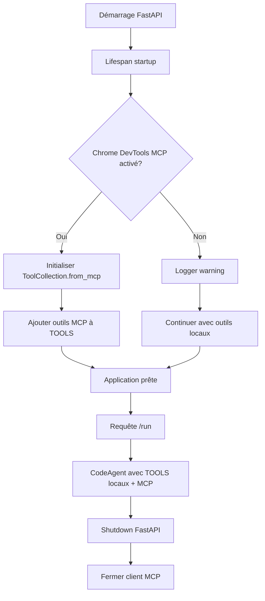

# Plan d'implémentation — TOOL-10: MCP Chrome DevTools

> Date : 2026-02-20
> Module : TOOL-10 — MCP Chrome DevTools (Puppeteer)
> Statut : ✅ **DONE**
> Priorité : Après validation des outils locaux existants

---

## 1. ANALYSE DE L'ÉTAT ACTUEL

### 1.1 Contexte du projet

Le projet my-claw a adopté une approche **100% locale** pour les outils smolagents après l'abandon de MCP pour TOOL-7 (Vision). Cependant, TOOL-10 (Chrome DevTools) présente un cas particulier :

- **TOOL-7 (Vision)** : Abandonné MCP → Solution locale avec Ollama qwen3-vl:2b
  - Raisons : Complexité inutile, performance médiocre, dépendance cloud, contre la philosophie du projet
  
- **TOOL-10 (Chrome DevTools)** : Approche MCP recommandée
  - Package officiel : chrome-devtools-mcp@latest
  - 26 outils disponibles immédiatement
  - Maintenance par l'équipe Chrome DevTools

### 1.2 État actuel du code

**agent/main.py** (90 lignes) :
- Aucune import MCP (pas de MCPClient, StdioServerParameters)
- Pas de lifespan FastAPI
- Juste des outils locaux chargés depuis `tools/__init__.py`

**agent/pyproject.toml** :
- Pas de dépendance MCP (pas de `mcp>=0.9.0`)
- `smolagents[litellm]>=1.9.0` (sans extra `[mcp]`)

**agent/tools/__init__.py** :
- 6 outils locaux (FileSystemTool, OsExecTool, ClipboardTool, ScreenshotTool, MouseKeyboardTool, VisionTool)

### 1.3 Décision d'approche

**Approche choisie : MCP avec chrome-devtools-mcp@latest**

**Raisons** :
1. Conforme aux spécifications de IMPLEMENTATION-TOOLS.md
2. Package officiel maintenu par l'équipe Chrome DevTools
3. 26 outils disponibles immédiatement (pas besoin de les implémenter manuellement)
4. Complexité gérable : un seul MCP server à intégrer
5. Complémentaire aux outils locaux (pilotage web vs pilotage OS)

**Contraintes** :
- Réintroduit la complexité MCP (lifespan FastAPI, event loop)
- Dépendance externe (npx chrome-devtools-mcp@latest)
- Timeout de démarrage (~5-10s au premier lancement)

---

## 2. ARCHITECTURE TECHNIQUE

### 2.1 Composants à modifier

| Fichier | Modifications | Raison |
|---------|---------------|--------|
| `agent/pyproject.toml` | Ajouter dépendances MCP | Support MCP |
| `agent/main.py` | Ajouter lifespan FastAPI + initialisation MCP | Gérer le cycle de vie du client MCP |
| `agent/tools/__init__.py` | Aucune modification (les outils MCP sont ajoutés dynamiquement) | Les outils MCP ne sont pas dans TOOLS statique |
| `agent/.env.example` | Ajouter variable d'environnement optionnelle | Configuration Chrome DevTools |

### 2.2 Flux d'intégration



### 2.3 Structure du code modifié

**agent/main.py** (structure cible) :

```python
# Imports ajoutés
from contextlib import asynccontextmanager
from smolagents import ToolCollection
from mcp import StdioServerParameters

# Variables globales pour MCP
_mcp_client: ToolCollection | None = None
_mcp_tools: list = []

# Lifespan FastAPI
@asynccontextmanager
async def lifespan(app: FastAPI):
    global _mcp_client, _mcp_tools
    
    # Startup: initialiser Chrome DevTools MCP
    try:
        chrome_devtools_params = StdioServerParameters(
            command="npx",
            args=["-y", "chrome-devtools-mcp@latest"],
            env={**os.environ}
        )
        _mcp_client = ToolCollection.from_mcp(
            "chrome-devtools",
            chrome_devtools_params,
            timeout=60
        )
        _mcp_tools = list(_mcp_client.tools)
        logger.info(f"✓ Chrome DevTools MCP chargé : {len(_mcp_tools)} outils")
    except Exception as e:
        logger.warning(f"✗ Impossible de charger Chrome DevTools MCP : {e}")
        _mcp_client = None
        _mcp_tools = []
    
    yield  # L'application tourne ici
    
    # Shutdown: fermer proprement
    if _mcp_client is not None:
        _mcp_client.__exit__(None, None, None)
        logger.info("✓ Chrome DevTools MCP fermé")

app = FastAPI(lifespan=lifespan)

# Fusion des outils locaux et MCP
def get_all_tools() -> list:
    """Retourne tous les outils disponibles (locaux + MCP)."""
    all_tools = TOOLS.copy()
    if _mcp_tools:
        all_tools.extend(_mcp_tools)
    return all_tools

# Dans @app.post("/run")
agent = CodeAgent(
    tools=get_all_tools(),  # Utiliser get_all_tools() au lieu de TOOLS
    ...
)
```

---

## 3. SPÉCIFICATIONS D'IMPLÉMENTATION

### 3.1 Modifications de agent/pyproject.toml

```toml
[project]
name = "my-claw-agent"
version = "0.1.0"
description = "my-claw — Agent Python smolagents"
requires-python = ">=3.11"

dependencies = [
    "smolagents[litellm,mcp]>=1.9.0",  # Ajout de [mcp]
    "fastapi>=0.115.0",
    "uvicorn[standard]>=0.32.0",
    "pydantic>=2.9.0",
    "requests>=2.32.0",
    "httpx>=0.27.0",
    "gradio>=5.0.0",
    "python-dotenv>=1.0.0",
    "pyperclip>=1.11.0",
    "pyautogui>=0.9.54",
    "pillow>=12.1.1",
    "mcp>=0.9.0",  # Ajout de mcp
]
```

**Commande pour ajouter les dépendances** :
```bash
cd agent
uv add "smolagents[litellm,mcp]>=1.9.0"
uv add "mcp>=0.9.0"
```

### 3.2 Modifications de agent/main.py

#### 3.2.1 Imports ajoutés

```python
from contextlib import asynccontextmanager
from smolagents import ToolCollection
from mcp import StdioServerParameters
```

#### 3.2.2 Variables globales pour MCP

```python
# Variables globales pour le client MCP Chrome DevTools
_mcp_client: ToolCollection | None = None
_mcp_tools: list = []
```

#### 3.2.3 Fonction lifespan

```python
@asynccontextmanager
async def lifespan(app: FastAPI):
    """
    Gestion du cycle de vie du client MCP Chrome DevTools.
    
    Startup:
    - Initialise le client MCP Chrome DevTools
    - Charge les outils MCP disponibles
    
    Shutdown:
    - Ferme proprement le client MCP
    """
    global _mcp_client, _mcp_tools
    
    # Startup: initialiser Chrome DevTools MCP
    logger.info("Démarrage Chrome DevTools MCP...")
    try:
        chrome_devtools_params = StdioServerParameters(
            command="npx",
            args=["-y", "chrome-devtools-mcp@latest"],
            env={**os.environ}  # Important pour trouver Node.js sur Windows
        )
        
        _mcp_client = ToolCollection.from_mcp(
            "chrome-devtools",
            chrome_devtools_params,
            timeout=60  # Timeout plus long au démarrage (npx télécharge le package)
        )
        
        _mcp_tools = list(_mcp_client.tools)
        logger.info(f"✓ Chrome DevTools MCP chargé : {len(_mcp_tools)} outils")
        logger.info(f"  Outils Chrome DevTools: {[t.name for t in _mcp_tools]}")
        
    except Exception as e:
        logger.warning(f"✗ Impossible de charger Chrome DevTools MCP : {e}")
        logger.warning("  L'agent fonctionnera avec les outils locaux uniquement")
        _mcp_client = None
        _mcp_tools = []
    
    yield  # L'application tourne ici, le client MCP reste actif
    
    # Shutdown: fermer proprement
    logger.info("Arrêt Chrome DevTools MCP...")
    if _mcp_client is not None:
        try:
            _mcp_client.__exit__(None, None, None)
            logger.info("✓ Chrome DevTools MCP fermé")
        except Exception as e:
            logger.error(f"✗ Erreur lors de la fermeture du client MCP : {e}")
```

#### 3.2.4 Fonction get_all_tools()

```python
def get_all_tools() -> list:
    """
    Retourne tous les outils disponibles (locaux + MCP).
    
    Returns:
        list: Liste des outils disponibles
    """
    all_tools = TOOLS.copy()
    if _mcp_tools:
        all_tools.extend(_mcp_tools)
    return all_tools
```

#### 3.2.5 Modification de l'initialisation FastAPI

```python
# Avant
app = FastAPI(title="my-claw agent", version="0.1.0")

# Après
app = FastAPI(title="my-claw agent", version="0.1.0", lifespan=lifespan)
```

#### 3.2.6 Modification des logs de démarrage

```python
# Avant
logger.info(f"Tools disponibles: {len(TOOLS)} outils locaux - 100% local, 0 donnée sortante")
logger.info(f"Outils: {[t.name for t in TOOLS]}")

# Après
logger.info(f"Tools disponibles: {len(TOOLS)} outils locaux")
logger.info(f"Outils locaux: {[t.name for t in TOOLS]}")
```

#### 3.2.7 Modification de @app.post("/run")

```python
# Avant
@app.post("/run")
async def run(req: RunRequest):
    try:
        logger.info(f"Exécution avec {len(TOOLS)} outils locaux")
        
        agent = CodeAgent(
            tools=TOOLS,  # ← Ici
            ...
        )

# Après
@app.post("/run")
async def run(req: RunRequest):
    try:
        all_tools = get_all_tools()
        mcp_count = len(all_tools) - len(TOOLS)
        logger.info(f"Exécution avec {len(TOOLS)} outils locaux + {mcp_count} outils MCP Chrome DevTools")
        
        agent = CodeAgent(
            tools=all_tools,  # ← Utiliser get_all_tools()
            ...
        )
```

### 3.3 Modifications de agent/.env.example

```env
# ... variables existantes ...

# Chrome DevTools MCP (optionnel)
# Si non configuré, Chrome DevTools MCP sera désactivé silencieusement
# CHROME_DEVTOOLS_ENABLED=false
```

---

## 4. OUTILS MCP CHROME DEVTOOLS DISPONIBLES

### 4.1 Liste des 26 outils

**Input automation (8 outils)** :
- `click` : cliquer sur un élément (uid, dblClick?, includeSnapshot?)
- `drag` : glisser un élément vers un autre (from_uid, to_uid, includeSnapshot?)
- `fill` : remplir un champ de saisie (uid, value, includeSnapshot?)
- `fill_form` : remplir plusieurs champs à la fois (elements[], includeSnapshot?)
- `handle_dialog` : gérer les boîtes de dialogue (action: accept/dismiss, promptText?)
- `hover` : survoler un élément (uid, includeSnapshot?)
- `press_key` : appuyer sur une touche ou combinaison (key: "Enter", "Control+A", etc., includeSnapshot?)
- `upload_file` : uploader un fichier (filePath, uid, includeSnapshot?)

**Navigation automation (6 outils)** :
- `close_page` : fermer une page (pageId)
- `list_pages` : lister les pages ouvertes
- `navigate_page` : naviguer vers une URL (type: url/back/forward/reload, url?, ignoreCache?, handleBeforeUnload?, timeout?)
- `new_page` : créer une nouvelle page (url, timeout?)
- `select_page` : sélectionner une page comme contexte (pageId, bringToFront?)
- `wait_for` : attendre qu'un texte apparaisse (text, timeout?)

**Emulation (2 outils)** :
- `emulate` : émuler diverses fonctionnalités (cpuThrottlingRate?, geolocation?, networkConditions?, userAgent?, viewport?)
- `resize_page` : redimensionner la page (width, height)

**Performance (3 outils)** :
- `performance_analyze_insight` : analyser une insight de performance (insightName, insightSetId)
- `performance_start_trace` : démarrer un enregistrement de trace (autoStop, reload, filePath?)
- `performance_stop_trace` : arrêter l'enregistrement de trace (filePath?)

**Network (2 outils)** :
- `get_network_request` : récupérer une requête réseau (reqid?, requestFilePath?, responseFilePath?)
- `list_network_requests` : lister les requêtes (includePreservedRequests?, pageIdx?, pageSize?, resourceTypes[]?)

**Debugging (5 outils)** :
- `evaluate_script` : exécuter du JavaScript (function: "() => { return document.title }", args[]?)
- `get_console_message` : récupérer un message console (msgid)
- `list_console_messages` : lister les messages console (includePreservedMessages?, pageIdx?, pageSize?, types[]?)
- `take_screenshot` : prendre un screenshot (format: png/jpeg/webp, fullPage?, quality?, uid?, filePath?)
- `take_snapshot` : prendre un snapshot textuel de la page (verbose?, filePath?)

### 4.2 Options de configuration supplémentaires

À ajouter dans `args` de `StdioServerParameters` si nécessaire :

| Option | Description | Défaut |
|--------|-------------|--------|
| `--headless=true` | Mode sans interface | `false` |
| `--channel=canary\|beta\|dev` | Utiliser une autre version de Chrome | `stable` |
| `--viewport=1280x720` | Taille initiale du viewport | Défaut Chrome |
| `--isolated=true` | Utiliser un profil temporaire | `false` |
| `--user-data-dir=C:\path\to\profile` | Profil personnalisé | Profil dédié |
| `--accept-insecure-certs=true` | Ignorer les erreurs SSL | `false` |
| `--category-performance=false` | Désactiver les outils de performance | `true` |
| `--category-network=false` | Désactiver les outils réseau | `true` |
| `--category-emulation=false` | Désactiver les outils d'émulation | `true` |

### 4.3 Profil Chrome

Le MCP server démarre automatiquement une instance Chrome avec un profil dédié :
- **Windows** : `%HOMEPATH%/.cache/chrome-devtools-mcp/chrome-profile-stable`
- **Linux/macOS** : `$HOME/.cache/chrome-devtools-mcp/chrome-profile-stable`

Le profil n'est pas effacé entre les runs. Pour utiliser un profil temporaire, ajouter `--isolated=true`.

---

## 5. DÉPENDANCES ET PRÉREQUIS

### 5.1 Dépendances Python

```bash
cd agent
uv add "smolagents[litellm,mcp]>=1.9.0"
uv add "mcp>=0.9.0"
```

### 5.2 Prérequis système

| Composant | Version requise | Vérification |
|-----------|----------------|--------------|
| Node.js | 20.19+ | `node --version` |
| npm/npx | Inclus avec Node.js | `npx --version` |
| Chrome | Stable ou plus récent | `chrome --version` |

### 5.3 Variables d'environnement

| Variable | Description | Requis | Défaut |
|----------|-------------|--------|--------|
| `OLLAMA_BASE_URL` | URL du serveur Ollama | Non | `http://localhost:11434` |
| `ZAI_API_KEY` | Clé API Z.ai (optionnel) | Non | - |
| `ZAI_BASE_URL` | URL API Z.ai (optionnel) | Non | `https://api.z.ai/api/coding/paas/v4` |
| `SCREENSHOT_DIR` | Dossier pour les screenshots | Non | `C:\tmp\myclawshots` |

---

## 6. TESTS DE VALIDATION

### 6.1 Tests de base

1. **Test de démarrage** :
   ```bash
   cd agent
   uv run uvicorn main:app --reload
   ```
   Vérifier dans les logs :
   ```
   ✓ Chrome DevTools MCP chargé : 26 outils
   Outils Chrome DevTools: ['click', 'drag', 'fill', ...]
   ```

2. **Test de navigation simple** :
   - Prompt : "Ouvre https://example.com dans Chrome"
   - Attendu : Chrome s'ouvre avec example.com

3. **Test de snapshot** :
   - Prompt : "Prends un snapshot de la page et liste les éléments visibles"
   - Attendu : Snapshot textuel retourné avec uid des éléments

4. **Test d'évaluation JavaScript** :
   - Prompt : "Récupère le titre H1 de la page via evaluate_script"
   - Attendu : Titre H1 retourné

5. **Test de screenshot** :
   - Prompt : "Prends un screenshot de la page entière"
   - Attendu : Screenshot PNG sauvegardé

6. **Test de navigation multi-pages** :
   - Prompt : "Va sur https://huggingface.co et prends un snapshot"
   - Attendu : Navigation vers huggingface.co + snapshot

7. **Test de recherche** :
   - Prompt : "Cherche 'smolagents' dans la barre de recherche et valide avec Enter"
   - Attendu : Recherche effectuée + résultats

8. **Test réseau** :
   - Prompt : "Liste les requêtes réseau de la page"
   - Attendu : Liste des requêtes réseau

9. **Test console** :
   - Prompt : "Vérifie les messages console de la page"
   - Attendu : Liste des messages console

### 6.2 Scénarios avancés

**Test performance** :
1. "Ouvre https://developers.chrome.com"
2. "Lance un enregistrement de performance trace avec autoStop et reload"
3. "Analyse les insights de performance"

**Test navigation multi-pages** :
1. "Crée une nouvelle page sur https://example.com"
2. "Crée une deuxième page sur https://huggingface.co"
3. "Liste toutes les pages ouvertes"
4. "Sélectionne la première page"
5. "Ferme la deuxième page"

**Test formulaire** :
1. "Ouvre un site avec un formulaire de contact"
2. "Prends un snapshot pour identifier les champs"
3. "Remplis le formulaire avec fill_form"
4. "Soumets le formulaire"

### 6.3 Checkpoint de validation

**Critères de succès** :
- ✅ Le serveur FastAPI démarre sans erreur
- ✅ Chrome DevTools MCP est chargé avec 26 outils
- ✅ Les logs affichent les outils Chrome DevTools disponibles
- ✅ L'agent peut naviguer vers une URL
- ✅ L'agent peut prendre un snapshot de la page
- ✅ L'agent peut exécuter du JavaScript
- ✅ L'agent peut prendre un screenshot
- ✅ L'agent peut gérer plusieurs pages
- ✅ L'agent peut remplir des formulaires
- ✅ Le client MCP se ferme proprement à l'arrêt

**Commit message** :
```
feat(tools): tool-10 mcp chrome devtools

- Ajout de la dépendance MCP (smolagents[litellm,mcp], mcp>=0.9.0)
- Intégration de Chrome DevTools MCP via ToolCollection.from_mcp()
- Ajout de lifespan FastAPI pour gérer le cycle de vie du client MCP
- 26 outils disponibles : navigation, input automation, debugging, etc.
- Fallback silencieux si Chrome DevTools MCP ne peut pas être chargé
```

---

## 7. GESTION DES ERREURS

### 7.1 Erreurs de démarrage

| Erreur | Cause | Solution |
|--------|-------|----------|
| `npx: command not found` | Node.js non installé | Installer Node.js 20.19+ |
| `TimeoutError` | npx trop lent au premier lancement | Augmenter timeout à 90s |
| `Chrome not found` | Chrome non installé | Installer Chrome stable |
| `PermissionError` | Droits insuffisants | Exécuter en admin (Windows) |

### 7.2 Erreurs d'exécution

| Erreur | Cause | Solution |
|--------|-------|----------|
| `RuntimeError: Event loop is closed` | Client MCP fermé incorrectement | Vérifier lifespan |
| `ValueError: I/O operation on closed pipe` | Client MCP fermé incorrectement | Vérifier lifespan |
| `TimeoutError` | Chrome trop lent à répondre | Augmenter timeout dans navigate_page() |

### 7.3 Logs de debug

Ajouter des logs détaillés pour diagnostiquer les problèmes :

```python
logger.info(f"✓ Chrome DevTools MCP chargé : {len(_mcp_tools)} outils")
logger.info(f"  Outils Chrome DevTools: {[t.name for t in _mcp_tools]}")
logger.warning(f"✗ Impossible de charger Chrome DevTools MCP : {e}")
logger.info("✓ Chrome DevTools MCP fermé")
```

---

## 8. BONNES PRATIQUES

### 8.1 Utilisation des outils

1. **Snapshot avant action** : Toujours utiliser `take_snapshot()` avant d'interagir avec la page pour connaître les uid des éléments.
2. **Privilégier snapshot à screenshot** : `take_snapshot()` est plus rapide et fournit des uid exploitables pour les interactions.
3. **Gestion des pages** : Utiliser `list_pages()` pour voir les pages ouvertes et `select_page()` pour changer de contexte.
4. **Attente de chargement** : Utiliser `wait_for()` ou laisser le tool gérer automatiquement les attentes.
5. **Performance traces** : Pour `performance_start_trace()`, naviguer d'abord vers l'URL voulue avec `navigate_page()`, puis lancer la trace.

### 8.2 Guidage de l'agent

Ajouter un skill dans `agent/skills.txt` pour guider l'agent dans l'utilisation de Chrome DevTools :

```python
# Chrome DevTools MCP Skills
def navigate_and_analyze(url: str):
    """
    Navigate to a URL and analyze the page.
    
    Args:
        url: The URL to navigate to
    """
    # Navigate to the URL
    navigate_page(url=url)
    
    # Take a snapshot to see the page structure
    snapshot = take_snapshot()
    
    # Take a screenshot for visual reference
    screenshot_path = take_screenshot()
    
    final_answer(f"Navigated to {url}\n\nSnapshot:\n{snapshot}\n\nScreenshot saved to: {screenshot_path}")

def fill_form_and_submit(form_data: dict):
    """
    Fill a form with data and submit it.
    
    Args:
        form_data: Dictionary of field_name: value pairs
    """
    # Take a snapshot to identify form fields
    snapshot = take_snapshot()
    
    # Fill the form using fill_form
    fill_form(elements=form_data)
    
    # Submit the form (usually by pressing Enter or clicking a submit button)
    press_key(key="Enter")
    
    final_answer(f"Form filled and submitted with data: {form_data}")
```

### 8.3 Timeout de démarrage

Le premier lancement de `npx chrome-devtools-mcp@latest` télécharge le package (~5-10s). Gérer avec un timeout approprié à l'initialisation (60s recommandé).

---

## 9. RÉSUMÉ DES MODIFICATIONS

### 9.1 Fichiers modifiés

| Fichier | Lignes ajoutées | Lignes modifiées | Lignes supprimées |
|---------|----------------|------------------|------------------|
| `agent/pyproject.toml` | 2 | 1 | 0 |
| `agent/main.py` | ~60 | ~10 | ~5 |
| `agent/.env.example` | 3 | 0 | 0 |

### 9.2 Commandes d'installation

```bash
cd agent
uv add "smolagents[litellm,mcp]>=1.9.0"
uv add "mcp>=0.9.0"
uv sync
```

### 9.3 Commandes de test

```bash
cd agent
uv run uvicorn main:app --reload
```

Puis tester via Gradio ou curl :

```bash
curl -X POST http://localhost:8000/run \
  -H "Content-Type: application/json" \
  -d '{"message": "Ouvre https://example.com dans Chrome"}'
```

---

## 10. PROCHAINES ÉTAPES

Une fois TOOL-10 validé :

1. Mettre à jour `PROGRESS.md` avec le statut DONE
2. Mettre à jour `LEARNING.md` avec les découvertes techniques
3. Passer au MODULE 4 : Canal Nextcloud Talk
4. Implémenter les modules restants (Cron & Proactivité, Z.ai + Health Check, Identity & Persona)

---

## 11. RÉFÉRENCES

- smolagents MCP : https://huggingface.co/docs/smolagents/tutorials/mcp
- Chrome DevTools MCP : https://github.com/ChromeDevTools/chrome-devtools-mcp
- IMPLEMENTATION-TOOLS.md : Spécifications TOOL-10
- AGENTS.md : Règles impératives pour l'IA de codage
- LEARNING.md : Découvertes my-claw
