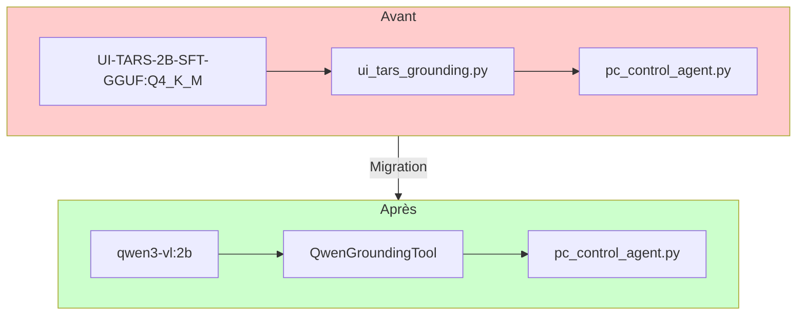

# Migration UI-TARS → qwen3-vl pour GUI Grounding

**Date** : 2026-02-21  
**Statut** : Planification  
**Objectif** : Remplacer le modèle `hf.co/mradermacher/UI-TARS-2B-SFT-GGUF:Q4_K_M` par `qwen3-vl:2b` pour le grounding GUI

---

## Résumé

Ce plan décrit la migration du modèle de GUI grounding de UI-TARS-2B-SFT vers qwen3-vl:2b. L'objectif est de simplifier l'architecture en utilisant un modèle vision unique (qwen3-vl) à la fois pour l'analyse d'images et le grounding GUI.

**Avantages** :
- Un seul modèle vision à gérer (qwen3-vl)
- Réduction de la complexité de l'installation
- Meilleure cohérence avec l'architecture existante (vision.py utilise déjà qwen3-vl)
- Prompt système spécialisé pour un grounding déterministe

---

## Architecture actuelle

```
agent/tools/ui_tars_grounding.py (UITarsGroundingTool)
├── Modèle : hf.co/mradermacher/UI-TARS-2B-SFT-GGUF:Q4_K_M
├── Prompt système : "Based on the screenshot of the page..."
├── API Ollama : /api/chat avec paramètre "images"
└── Retour : coordonnées relatives [x, y] dans [0, 1]

pc_control_agent.py
├── Tools : screenshot, ui_grounding, mouse_keyboard
├── Modèle LLM : qwen3:8b (orchestration)
└── Utilise ui_grounding pour localiser les éléments UI

main.py
├── Détection UI-TARS dans detect_models()
└── Documentation dans /models endpoint
```

---

## Architecture cible

```
agent/tools/grounding.py (QwenGroundingTool)
├── Modèle : qwen3-vl:2b (ou qwen3-vl:8b selon disponibilité)
├── Prompt système : "You are a GUI grounding assistant..."
├── API Ollama : /api/chat avec format OpenAI (content array)
└── Retour : coordonnées relatives [x, y] dans [0, 1]

pc_control_agent.py
├── Tools : screenshot, ui_grounding, mouse_keyboard
├── Modèle LLM : qwen3:8b (orchestration)
└── Utilise ui_grounding pour localiser les éléments UI

main.py
├── Détection qwen3-vl dans detect_models()
└── Documentation dans /models endpoint
```

---

## Fichiers à modifier

### 1. Renommer `agent/tools/ui_tars_grounding.py` → `agent/tools/grounding.py`

**Raison** : Le nom `ui_tars_grounding.py` fait référence à l'ancien modèle UI-TARS. Le nouveau nom `grounding.py` est plus générique et ne fait référence à aucun modèle spécifique.

### 2. Modifier `agent/tools/grounding.py`

**Modifications** :
- Renommer la classe de `UITarsGroundingTool` à `QwenGroundingTool`
- Changer le modèle de `hf.co/mradermacher/UI-TARS-2B-SFT-GGUF:Q4_K_M` à `qwen3-vl:2b`
- Remplacer le prompt système par le nouveau prompt spécialisé grounding
- Changer le format de l'API Ollama pour utiliser le format OpenAI (content array)
- Ajouter une détection automatique du modèle qwen3-vl disponible (2b, 4b, 8b)

**Nouveau prompt système** :
```python
_GROUNDING_SYSTEM = """You are a GUI grounding assistant. 
Given a screenshot and a text description of a UI element, 
return ONLY the coordinates of that element as [x, y] 
where x and y are relative values between 0 and 1 
(0,0 = top-left corner, 1,1 = bottom-right corner).

Return ONLY the coordinate in this exact format: [0.XX, 0.XX]
No explanation, no text, just the coordinate."""
```

**Nouveau format API** :
```python
response = requests.post(
    f"{ollama_url}/api/chat",
    json={
        "model": vision_model,  # qwen3-vl:2b détecté automatiquement
        "messages": [
            {
                "role": "user",
                "content": [
                    {
                        "type": "image_url",
                        "image_url": {"url": f"data:image/png;base64,{image_b64}"}
                    },
                    {
                        "type": "text",
                        "text": f"{_GROUNDING_SYSTEM}\n\nFind this element: {element}"
                    }
                ]
            }
        ],
        "stream": False,
        "options": {"temperature": 0.0}
    },
    timeout=60,
)
```

### 2. `agent/agents/pc_control_agent.py`

**Modifications** :
- Mettre à jour la docstring pour mentionner qwen3-vl au lieu de UI-TARS-2B-SFT
- Mettre à jour la description de l'agent dans le paramètre `description`

### 3. `agent/main.py`

**Modifications** :
- Remplacer la détection UI-TARS par une détection qwen3-vl dans `detect_models()`
- Mettre à jour les logs pour mentionner qwen3-vl
- Mettre à jour l'endpoint `/models` pour documenter qwen3-vl

**Ancien code** :
```python
# Vérifier présence UI-TARS pour pc_control_agent
uitars_model = "hf.co/mradermacher/UI-TARS-2B-SFT-GGUF:Q4_K_M"
if uitars_model in available:
    logger.info(f"✓ UI-TARS-2B-SFT détecté pour pc_control_agent")
else:
    logger.warning(f"✗ UI-TARS-2B-SFT non trouvé — installer avec: ollama pull {uitars_model}")
```

**Nouveau code** :
```python
# Vérifier présence qwen3-vl pour pc_control_agent (grounding)
vision_models = [m for m in available if m.startswith("qwen3-vl")]
if vision_models:
    logger.info(f"✓ qwen3-vl détecté pour pc_control_agent grounding: {vision_models}")
else:
    logger.warning(f"✗ qwen3-vl non trouvé — installer avec: ollama pull qwen3-vl:2b")
```

### 4. `agent/test_ui_tars.py`

**Modifications** :
- Renommer le fichier en `test_qwen_grounding.py`
- Mettre à jour les tests pour utiliser qwen3-vl au lieu de UI-TARS-2B-SFT
- Mettre à jour les logs et messages de test

### 5. `AGENTS.md`

**Modifications** :
- Mettre à jour la section TOOL-9 pour mentionner qwen3-vl au lieu de UI-TARS-2B-SFT
- Mettre à jour les exemples et la documentation

### 6. `LEARNING.md`

**Ajouts** :
- Nouvelle section documentant la migration UI-TARS → qwen3-vl
- Découvertes techniques sur le format OpenAI pour qwen3-vl
- Comparaison des performances entre UI-TARS et qwen3-vl

---

## Implémentation détaillée

### Étape 0 : Renommer `ui_tars_grounding.py` → `grounding.py`

```bash
# Renommer le fichier
cd agent/tools
mv ui_tars_grounding.py grounding.py
```

### Étape 1 : Modification de `grounding.py`

```python
"""
QwenGroundingTool — Détection d'éléments UI avec qwen3-vl.

Spécialisé pour le GUI grounding : localise précisément les éléments
d'interface à partir d'une description textuelle et d'un screenshot.
Retourne les coordonnées pixel absolues pour pyautogui.
"""

import logging
import os
import base64
import json
import re
from pathlib import Path
from typing import Optional

from smolagents import Tool

logger = logging.getLogger(__name__)

# Prompt système qwen3-vl pour grounding desktop
_GROUNDING_SYSTEM = """You are a GUI grounding assistant. 
Given a screenshot and a text description of a UI element, 
return ONLY the coordinates of that element as [x, y] 
where x and y are relative values between 0 and 1 
(0,0 = top-left corner, 1,1 = bottom-right corner).

Return ONLY the coordinate in this exact format: [0.XX, 0.XX]
No explanation, no text, just the coordinate."""

# Cache pour le modèle de vision détecté (évite de redétecter à chaque appel)
_detected_vision_model: str | None = None


def _detect_grounding_model() -> str:
    """
    Détecte automatiquement le meilleur modèle qwen3-vl pour le grounding.

    Returns:
        Nom du modèle de vision à utiliser
    """
    global _detected_vision_model

    # Retourner le modèle en cache si déjà détecté
    if _detected_vision_model is not None:
        return _detected_vision_model

    try:
        import requests
        ollama_url = os.environ.get("OLLAMA_BASE_URL", "http://localhost:11434")
        response = requests.get(f"{ollama_url}/api/tags", timeout=5)
        response.raise_for_status()
        available_models = [m["name"] for m in response.json().get("models", [])]

        # Préférences : qwen3-vl:2b (plus rapide), qwen3-vl:4b, qwen3-vl:8b
        vision_preferences = ["qwen3-vl:2b", "qwen3-vl:4b", "qwen3-vl:8b"]

        # Chercher les modèles qwen3-vl:*
        vision_models = [m for m in available_models if m.startswith("qwen3-vl")]

        logger.info(f"Modèles qwen3-vl détectés: {vision_models}")

        if vision_models:
            # Choisir selon les préférences
            vision_model = None
            for pref in vision_preferences:
                if pref in vision_models:
                    vision_model = pref
                    logger.info(f"✓ QwenGroundingTool utilise modèle: {vision_model}")
                    break
            if vision_model is None:
                # Fallback sur le premier modèle disponible
                vision_model = vision_models[0]
                logger.info(f"✓ QwenGroundingTool utilise modèle (fallback): {vision_model}")
        else:
            # Aucun modèle qwen3-vl trouvé
            raise RuntimeError(
                "Aucun modèle qwen3-vl trouvé. "
                "Installez-en un avec: ollama pull qwen3-vl:2b"
            )

        _detected_vision_model = vision_model
        return vision_model

    except Exception as e:
        logger.error(f"Impossible de détecter les modèles qwen3-vl: {e}")
        raise RuntimeError(f"Impossible de détecter les modèles qwen3-vl: {e}")


class QwenGroundingTool(Tool):
    """Localise un élément UI dans un screenshot avec qwen3-vl.

    Utilise le modèle vision qwen3-vl via Ollama local.
    Retourne les coordonnées pixel absolues (x, y) pour pyautogui.
    """

    name = "ui_grounding"
    structured_output = False
    description = (
        "Localise un élément d'interface utilisateur dans un screenshot et retourne "
        "ses coordonnées pixel absolues (x, y) pour cliquer dessus avec pyautogui. "
        "Utilise qwen3-vl, modèle vision local. "
        "Exemple: ui_grounding(image_path='C:/tmp/screen.png', element='bouton OK') "
        "→ retourne '{\"x\": 960, \"y\": 540, \"found\": true}'"
    )
    inputs = {
        "image_path": {
            "type": "string",
            "description": "Chemin absolu vers le screenshot PNG à analyser",
        },
        "element": {
            "type": "string",
            "description": "Description textuelle de l'élément à localiser (ex: 'bouton OK', 'champ de recherche', 'menu Fichier')",
        },
    }
    output_type = "string"

    def forward(self, image_path: str, element: str) -> str:
        """
        Localise un élément UI dans le screenshot.

        Args:
            image_path: Chemin absolu vers le screenshot
            element: Description de l'élément à localiser

        Returns:
            JSON string: {"x": int, "y": int, "found": bool, "rel_x": float, "rel_y": float}
            ou "ERROR: ..." en cas d'échec
        """
        import requests
        from PIL import Image

        try:
            # Vérifier que le fichier existe
            if not Path(image_path).exists():
                return f"ERROR: Screenshot non trouvé: {image_path}"

            # Obtenir les dimensions de l'image pour conversion coordonnées relatives → absolues
            with Image.open(image_path) as img:
                screen_width, screen_height = img.size

            logger.info(f"qwen3-vl grounding: '{element}' dans {image_path} ({screen_width}x{screen_height})")

            # Détecter le meilleur modèle qwen3-vl disponible
            vision_model = _detect_grounding_model()

            # Encoder l'image en base64
            with open(image_path, "rb") as f:
                image_b64 = base64.b64encode(f.read()).decode("utf-8")

            # Appel Ollama avec qwen3-vl en format OpenAI
            ollama_url = os.environ.get("OLLAMA_BASE_URL", "http://localhost:11434")
            response = requests.post(
                f"{ollama_url}/api/chat",
                json={
                    "model": vision_model,
                    "messages": [
                        {
                            "role": "user",
                            "content": [
                                {
                                    "type": "image_url",
                                    "image_url": {"url": f"data:image/png;base64,{image_b64}"}
                                },
                                {
                                    "type": "text",
                                    "text": f"{_GROUNDING_SYSTEM}\n\nFind this element: {element}"
                                }
                            ]
                        }
                    ],
                    "stream": False,
                    "options": {
                        "temperature": 0.0,  # Déterministe pour le grounding
                        "num_ctx": 32768,
                    },
                },
                timeout=60,
            )
            response.raise_for_status()

            raw_output = response.json().get("message", {}).get("content", "").strip()
            logger.info(f"qwen3-vl output brut: {raw_output}")

            # Parser les coordonnées relatives [x, y] retournées par qwen3-vl
            coords = self._parse_coordinates(raw_output)
            if coords is None:
                return json.dumps({
                    "found": False,
                    "error": f"Impossible de parser les coordonnées depuis: {raw_output}",
                    "raw": raw_output,
                })

            rel_x, rel_y = coords

            # Convertir en coordonnées absolues pixel
            abs_x = int(rel_x * screen_width)
            abs_y = int(rel_y * screen_height)

            logger.info(f"Élément '{element}' trouvé: rel=({rel_x:.3f}, {rel_y:.3f}) → abs=({abs_x}, {abs_y})")

            return json.dumps({
                "found": True,
                "x": abs_x,
                "y": abs_y,
                "rel_x": round(rel_x, 4),
                "rel_y": round(rel_y, 4),
                "screen_size": f"{screen_width}x{screen_height}",
                "element": element,
            })

        except requests.Timeout:
            return "ERROR: Timeout qwen3-vl (>60s) — modèle peut-être non chargé"
        except requests.RequestException as e:
            return f"ERROR: Ollama non accessible: {e}"
        except Exception as e:
            logger.error(f"Erreur QwenGroundingTool: {e}", exc_info=True)
            return f"ERROR: {type(e).__name__}: {e}"

    def _parse_coordinates(self, text: str) -> Optional[tuple[float, float]]:
        """Parse les coordonnées relatives [x, y] depuis la réponse qwen3-vl."""
        # qwen3-vl retourne typiquement: [0.73, 0.21]
        # Parfois avec du texte autour
        patterns = [
            r'\[(\d+\.?\d*),\s*(\d+\.?\d*)\]',   # [0.73, 0.21]
            r'\((\d+\.?\d*),\s*(\d+\.?\d*)\)',   # (0.73, 0.21)
            r'(\d+\.?\d*),\s*(\d+\.?\d*)',         # 0.73, 0.21
        ]
        for pattern in patterns:
            match = re.search(pattern, text)
            if match:
                x, y = float(match.group(1)), float(match.group(2))
                # Valider que les coordonnées sont dans [0, 1]
                if 0 <= x <= 1 and 0 <= y <= 1:
                    return x, y
        return None
```

### Étape 2 : Modification de `pc_control_agent.py`

```python
"""
pc_control_agent — Agent spécialisé pilotage PC Windows.

Outils : screenshot, ui_grounding (qwen3-vl), mouse_keyboard
Modèle : glm-4.7 ou qwen3:8b (local, 0 quota)
Rôle : Voir l'écran, localiser les éléments, cliquer, taper

NOTE : ui_grounding utilise qwen3-vl en interne pour le GUI grounding.
"""
```

```python
description=(
    "Agent spécialisé pour piloter l'interface graphique Windows. "
    "Peut prendre des screenshots, localiser précisément les éléments UI (qwen3-vl grounding), "
    "et interagir avec la souris et le clavier. "
    "Utilise-le pour : ouvrir des applications, cliquer sur des boutons, "
    "remplir des formulaires, naviguer dans Windows. "
    "Pour analyser des images, délègue au sous-agent vision_agent."
),
```

### Étape 3 : Modification de `main.py`

```python
def detect_models() -> dict[str, tuple[str, str]]:
    global _detected_models
    if _detected_models is not None:
        return _detected_models

    ollama_url = os.environ.get("OLLAMA_BASE_URL", "http://localhost:11434")
    available = get_ollama_models()
    logger.info(f"Modèles Ollama détectés: {available}")

    detected = {}
    for category, preferences in MODEL_PREFERENCES.items():
        for model_name in preferences:
            if model_name in available:
                detected[category] = (f"ollama_chat/{model_name}", ollama_url)
                logger.info(f"✓ {category}: {model_name}")
                break
        else:
            logger.warning(f"✗ {category}: aucun modèle trouvé parmi {preferences}")

    # Vérifier présence qwen3-vl pour pc_control_agent (grounding)
    vision_models = [m for m in available if m.startswith("qwen3-vl")]
    if vision_models:
        logger.info(f"✓ qwen3-vl détecté pour pc_control_agent grounding: {vision_models}")
    else:
        logger.warning(f"✗ qwen3-vl non trouvé — installer avec: ollama pull qwen3-vl:2b")

    detected.update(CLOUD_MODELS)
    _detected_models = detected
    return detected
```

```python
@app.get("/models")
async def list_models():
    models_info = {}
    for category, (model_name, base_url) in MODELS.items():
        display_name = model_name.split("/")[-1] if "/" in model_name else model_name
        is_local = "ollama_chat/" in model_name or "localhost" in base_url
        models_info[category] = {
            "name": display_name,
            "full_name": model_name,
            "type": "local" if is_local else "cloud",
            "available": True,
        }
    return {
        "models": models_info,
        "ollama_models": get_ollama_models(),
        "sub_agents": {
            "pc_control": "glm-4.7 ou qwen3:8b + qwen3-vl (interne)",
            "vision": "glm-4.7 ou qwen3:8b + analyze_image (qwen3-vl interne)",
            "browser": f"glm-4.7 ou qwen3:8b + {len(_chrome_mcp_tools)} tools Chrome DevTools",
            "web_search": f"glm-4.7 ou qwen3:8b + {len(_web_search_tools)} tools Z.ai MCP",
        },
    }
```

### Étape 4 : Création de `test_grounding.py`

```python
"""
Script de test pour vérifier que le modèle qwen3-vl fonctionne correctement pour le grounding.

Teste :
1. Le modèle qwen3-vl est accessible via Ollama
2. Le modèle peut trouver des éléments UI et donner leurs coordonnées
"""

import os
import sys
import base64
import requests
from pathlib import Path

# Configuration
OLLAMA_URL = os.environ.get("OLLAMA_BASE_URL", "http://localhost:11434")
SCREENSHOT_PATH = r"C:\tmp\myclawshots\screen_20260221_231135.png"
GROUNDING_SYSTEM = """You are a GUI grounding assistant. 
Given a screenshot and a text description of a UI element, 
return ONLY the coordinates of that element as [x, y] 
where x and y are relative values between 0 and 1 
(0,0 = top-left corner, 1,1 = bottom-right corner).

Return ONLY the coordinate in this exact format: [0.XX, 0.XX]
No explanation, no text, just the coordinate."""


def test_ollama_connection():
    """Teste que Ollama est accessible."""
    print("=" * 60)
    print("TEST 1: Connexion à Ollama")
    print("=" * 60)

    try:
        response = requests.get(f"{OLLAMA_URL}/api/tags", timeout=5)
        response.raise_for_status()
        models = response.json().get("models", [])
        print(f"✓ Ollama accessible")
        print(f"  Modèles disponibles: {[m['name'] for m in models]}")
        return True

    except Exception as e:
        print(f"  ✗ Erreur: {e}")
        return False


def test_qwen_vl_installed():
    """Teste que le modèle qwen3-vl est installé."""
    print("\n" + "=" * 60)
    print("TEST 2: Vérification du modèle qwen3-vl")
    print("=" * 60)

    try:
        response = requests.get(f"{OLLAMA_URL}/api/tags", timeout=5)
        response.raise_for_status()
        models = response.json().get("models", [])

        # Chercher le modèle qwen3-vl
        qwen_vl_models = [m['name'] for m in models if m['name'].startswith('qwen3-vl')]
        print(f"  Modèles qwen3-vl trouvés: {qwen_vl_models}")

        if qwen_vl_models:
            print(f"  ✓ qwen3-vl installé")
            return True
        else:
            print(f"  ✗ qwen3-vl NON installé")
            print(f"  → Commande d'installation: ollama pull qwen3-vl:2b")
            return False

    except Exception as e:
        print(f"  ✗ Erreur: {e}")
        return False


def test_qwen_vl_grounding():
    """Teste le modèle qwen3-vl pour le grounding."""
    print("\n" + "=" * 60)
    print("TEST 3: Test du modèle qwen3-vl pour grounding")
    print("=" * 60)

    # Vérifier que le screenshot existe
    if not Path(SCREENSHOT_PATH).exists():
        print(f"  ✗ Screenshot non trouvé: {SCREENSHOT_PATH}")
        return False

    print(f"  ✓ Screenshot trouvé: {SCREENSHOT_PATH}")

    # Encoder l'image en base64
    try:
        with open(SCREENSHOT_PATH, "rb") as f:
            image_data = f.read()
            image_b64 = base64.b64encode(image_data).decode("utf-8")
        print(f"  ✓ Image encodée en base64 ({len(image_b64)} chars)")
    except Exception as e:
        print(f"  ✗ Erreur encodage: {e}")
        return False

    # Tester le modèle qwen3-vl
    try:
        element = "Windows Start button"
        print(f"  → Élément à trouver: {element}")
        print(f"  → Envoi à Ollama avec modèle qwen3-vl:2b...")

        response = requests.post(
            f"{OLLAMA_URL}/api/chat",
            json={
                "model": "qwen3-vl:2b",
                "messages": [
                    {
                        "role": "user",
                        "content": [
                            {
                                "type": "image_url",
                                "image_url": {"url": f"data:image/png;base64,{image_b64}"}
                            },
                            {
                                "type": "text",
                                "text": f"{GROUNDING_SYSTEM}\n\nFind this element: {element}"
                            }
                        ]
                    }
                ],
                "stream": False,
                "options": {"temperature": 0.0}
            },
            timeout=180,
        )
        response.raise_for_status()
        result = response.json()
        response_text = result.get("message", {}).get("content", "")

        if response_text:
            print(f"  ✓ Réponse reçue ({len(response_text)} caractères)")
            print(f"\n  --- Réponse du modèle ---")
            print(response_text)
            print(f"  --- Fin de la réponse ---\n")
            return True
        else:
            print(f"  ✗ Réponse vide")
            return False

    except requests.Timeout:
        print(f"  ✗ Timeout (>180s)")
        return False
    except requests.RequestException as e:
        print(f"  ✗ Erreur de communication: {e}")
        return False
    except Exception as e:
        print(f"  ✗ Erreur: {e}")
        import traceback
        traceback.print_exc()
        return False


def test_qwen_grounding_tool():
    """Teste l'outil qwen_grounding directement."""
    print("\n" + "=" * 60)
    print("TEST 4: Test de l'outil qwen_grounding")
    print("=" * 60)

    try:
        from tools.grounding import QwenGroundingTool

        tool = QwenGroundingTool()
        print(f"  ✓ Outil QwenGroundingTool créé")

        result = tool.forward(
            image_path=SCREENSHOT_PATH,
            element="Windows Start button"
        )

        if result.startswith("ERROR:"):
            print(f"  ✗ Erreur: {result}")
            return False
        else:
            print(f"  ✓ Réponse reçue ({len(result)} caractères)")
            print(f"\n  --- Résultat de l'outil ---")
            print(result)
            print(f"  --- Fin du résultat ---\n")
            return True

    except Exception as e:
        print(f"  ✗ Erreur: {e}")
        import traceback
        traceback.print_exc()
        return False


def main():
    """Exécute tous les tests."""
    print("\n" + "=" * 60)
    print("SCRIPT DE TEST - qwen3-vl Grounding")
    print("=" * 60)

    results = []

    # Test 1: Connexion Ollama
    results.append(("Connexion Ollama", test_ollama_connection()))

    # Test 2: Vérification modèle qwen3-vl
    results.append(("Modèle qwen3-vl installé", test_qwen_vl_installed()))

    # Test 3: Modèle qwen3-vl grounding
    results.append(("Modèle qwen3-vl grounding", test_qwen_vl_grounding()))

    # Test 4: Outil qwen_grounding
    results.append(("Outil qwen_grounding", test_qwen_grounding_tool()))

    # Résumé
    print("\n" + "=" * 60)
    print("RÉSUMÉ DES TESTS")
    print("=" * 60)

    for test_name, result in results:
        status = "✓ PASS" if result else "✗ FAIL"
        print(f"  {status} - {test_name}")

    # Code de retour
    all_passed = all(result for _, result in results)
    if all_passed:
        print("\n  ✓ TOUS LES TESTS SONT PASSÉS")
        return 0
    else:
        print("\n  ✗ CERTAINS TESTS ONT ÉCHOUÉ")
        return 1


if __name__ == "__main__":
    sys.exit(main())
```

---

## Diagramme de migration



---

## Avantages de la migration

1. **Simplification** : Un seul modèle vision à gérer (qwen3-vl)
2. **Cohérence** : Utilisation du même modèle pour l'analyse d'images et le grounding
3. **Performance** : qwen3-vl:2b est plus léger et plus rapide que UI-TARS-2B-SFT
4. **Maintenance** : Moins de modèles à installer et à maintenir
5. **Prompt spécialisé** : Prompt système optimisé pour un grounding déterministe

---

## Risques et mitigations

| Risque | Mitigation |
|--------|-----------|
| qwen3-vl peut être moins précis que UI-TARS pour le grounding | Tests approfondis avant mise en production |
| Le format OpenAI peut ne pas être supporté par Ollama | Tests avec l'API Ollama pour valider le format |
| La détection automatique peut échouer | Fallback sur qwen3-vl:2b par défaut |
| Le parsing des coordonnées peut échouer | Patterns regex robustes et tests |

---

## Tests de validation

1. **Test de connexion Ollama** : Vérifier que Ollama est accessible
2. **Test de détection qwen3-vl** : Vérifier que qwen3-vl est installé
3. **Test de grounding** : Localiser un élément UI simple (ex: bouton Démarrer)
4. **Test de l'outil** : Tester QwenGroundingTool directement
5. **Test d'intégration** : Tester pc_control_agent avec le nouvel outil
6. **Test de régression** : Vérifier que les fonctionnalités existantes ne sont pas cassées

---

## Checklist de migration

- [ ] Renommer `ui_tars_grounding.py` en `grounding.py`
- [ ] Modifier `grounding.py` pour utiliser qwen3-vl
- [ ] Mettre à jour `pc_control_agent.py`
- [ ] Mettre à jour `main.py`
- [ ] Renommer `test_ui_tars.py` en `test_grounding.py`
- [ ] Mettre à jour `AGENTS.md`
- [ ] Mettre à jour `LEARNING.md`
- [ ] Exécuter les tests de validation
- [ ] Vérifier que tous les tests passent
- [ ] Mettre à jour la documentation utilisateur si nécessaire

---

## Commandes utiles

```bash
# Installer qwen3-vl:2b
ollama pull qwen3-vl:2b

# Vérifier les modèles installés
ollama list

# Renommer le fichier
cd agent/tools
mv ui_tars_grounding.py grounding.py

# Tester le grounding manuellement
cd agent
uv run python test_grounding.py

# Démarrer l'agent
uv run uvicorn main:app --reload
```

---

## Références

- qwen3-vl : https://ollama.com/library/qwen3-vl
- Ollama API : https://github.com/ollama/ollama/blob/main/docs/api.md
- smolagents Tool : https://huggingface.co/docs/smolagents/tutorials/custom_tools
