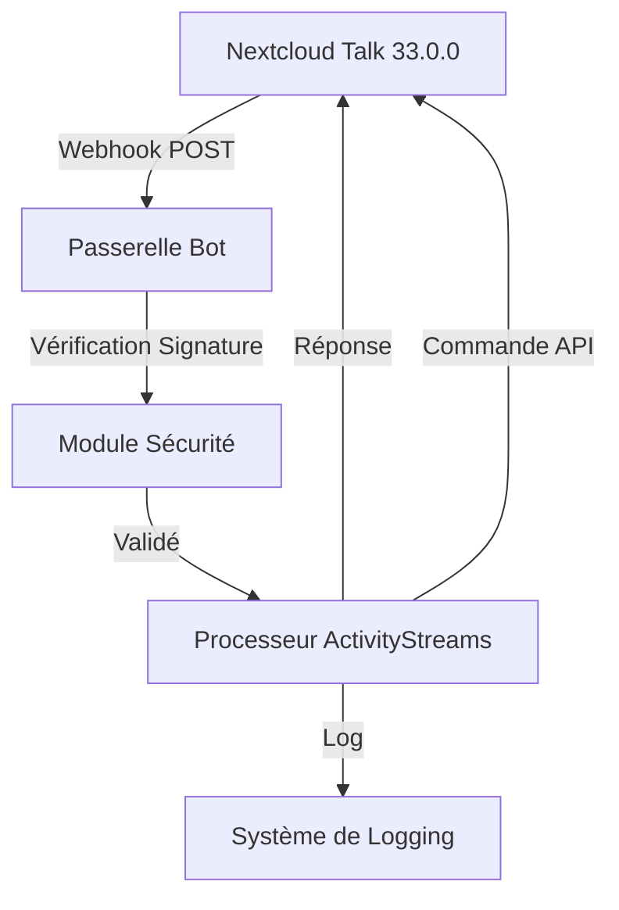
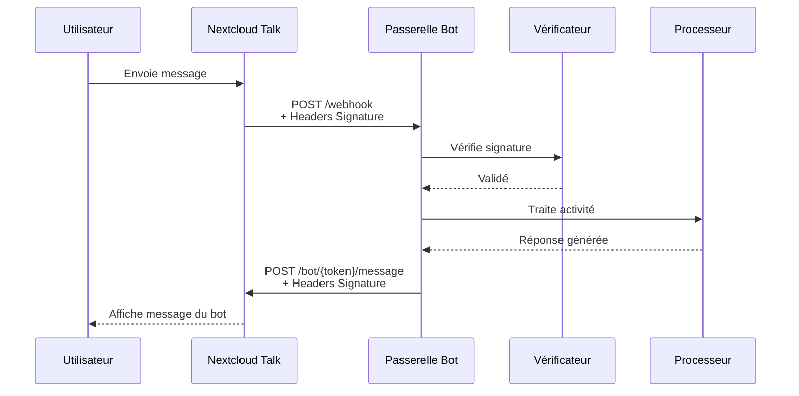
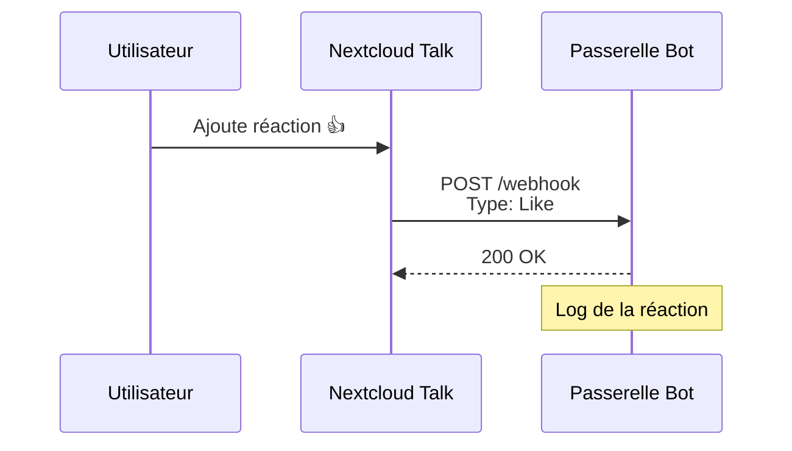

# Plan d'Implémentation - Module 4 : Bot Nextcloud Talk

## Vue d'ensemble

Ce document fournit un guide d'instructions exécutif complet pour mettre en place un bot sur le canal Nextcloud Talk pour l'instance Nextcloud Hub 26 Winter (33.0.0) accessible à https://cd.next-cloud.ovh.

## Architecture du Système



## Prérequis

### Configuration Nextcloud
- **Instance** : Nextcloud Hub 26 Winter (33.0.0)
- **URL** : https://cd.next-cloud.ovh
- **Capacité requise** : `bots-v1` (disponible depuis Nextcloud 27.1, confirmée pour 33.0.0)
- **Accès administrateur** : Accès SSH pour exécuter les commandes OCC

### Configuration de la Passerelle Bot
- **URL publique** : Doit être accessible depuis Nextcloud
- **Support HTTPS** : Recommandé pour la sécurité
- **Langage** : Python/Node.js/PHP (selon préférence)

---

## Étape 1 : Préparation de la Passerelle Bot

### 1.1 Structure du Projet

Créer une structure de projet pour la passerelle bot :

```
nextcloud-bot/
├── src/
│   ├── bot.py                # Point d'entrée principal
│   ├── security.py            # Module de vérification des signatures
│   ├── activity_processor.py  # Traitement des flux ActivityStreams
│   └── api_client.py         # Client pour envoyer des messages
├── config/
│   └── config.yaml            # Configuration du bot
├── logs/
│   └── bot.log
├── requirements.txt
└── README.md
```

### 1.2 Configuration Initiale

Créer le fichier `config/config.yaml` :

```yaml
# Configuration du Bot Nextcloud Talk
bot:
  name: "My-Claw Bot"
  description: "Assistant personnel my-claw pour Nextcloud Talk"
  secret: "VOTRE_SECRET_A_GENERER_MIN_40_CARACTERES"
  url: "https://votre-passerelle.com/webhook"
  
nextcloud:
  base_url: "https://cd.next-cloud.ovh"
  bot_token: "TOKEN_DU_BOT_A_OBTENIR_APRES_INSTALLATION"
  
features:
  webhook: true      # Recevoir les messages de chat
  response: true     # Envoyer des messages et réactions
  reaction: false    # Recevoir les notifications de réactions
  event: false       # Utiliser les événements locaux (Nextcloud apps)
  
security:
  signature_algorithm: "sha256"
  timeout: 30  # secondes
  
logging:
  level: "INFO"
  file: "logs/bot.log"
  max_size: 10485760  # 10MB
  backup_count: 5
```

**IMPORTANT** : Le secret doit être généré de manière sécurisée et contenir au minimum 40 caractères (maximum 128).

### 1.3 Génération du Secret

Générer un secret sécurisé :

```bash
# Méthode 1 : OpenSSL
openssl rand -hex 64

# Méthode 2 : Python
python3 -c "import secrets; print(secrets.token_hex(64))"

# Méthode 3 : Node.js
node -e "console.log(require('crypto').randomBytes(64).toString('hex'))"
```

---

## Étape 2 : Implémentation du Module de Sécurité

### 2.1 Vérification des Signatures

Créer `src/security.py` :

```python
import hmac
import hashlib
from typing import Optional, Dict, Any
import logging

logger = logging.getLogger(__name__)

class SignatureVerifier:
    """
    Vérifie les signatures HMAC SHA256 des requêtes Nextcloud Talk
    Conforme à la spécification Nextcloud Talk Bot API
    """
    
    def __init__(self, secret: str):
        """
        Initialise le vérificateur avec le secret partagé
        
        Args:
            secret: Secret partagé avec Nextcloud (min 40, max 128 caractères)
        """
        if len(secret) < 40 or len(secret) > 128:
            raise ValueError("Le secret doit contenir entre 40 et 128 caractères")
        self.secret = secret.encode('utf-8')
        logger.info("Vérificateur de signature initialisé")
    
    def verify_request(
        self, 
        signature_header: str, 
        random_header: str, 
        body: bytes
    ) -> bool:
        """
        Vérifie que la signature correspond au corps de la requête
        
        Args:
            signature_header: Valeur de l'en-tête HTTP_X_NEXTCLOUD_TALK_SIGNATURE
            random_header: Valeur de l'en-tête HTTP_X_NEXTCLOUD_TALK_RANDOM
            body: Corps de la requête en bytes
            
        Returns:
            True si la signature est valide, False sinon
        """
        try:
            # Créer le HMAC SHA256
            # Format: HMAC(RANDOM + BODY, SECRET)
            message = random_header.encode('utf-8') + body
            digest = hmac.new(
                self.secret,
                message,
                hashlib.sha256
            ).hexdigest()
            
            # Comparer avec la signature reçue (insensible à la casse)
            is_valid = hmac.compare_digest(
                digest.lower(),
                signature_header.lower()
            )
            
            if not is_valid:
                logger.warning("Signature invalide détectée")
            else:
                logger.debug("Signature validée avec succès")
                
            return is_valid
            
        except Exception as e:
            logger.error(f"Erreur lors de la vérification de la signature: {e}")
            return False
    
    def extract_headers(self, headers: Dict[str, Any]) -> Optional[Dict[str, str]]:
        """
        Extrait les en-têtes pertinents de la requête
        
        Args:
            headers: Dictionnaire des en-têtes HTTP
            
        Returns:
            Dictionnaire contenant signature et random, ou None si manquants
        """
        signature = headers.get('HTTP_X_NEXTCLOUD_TALK_SIGNATURE')
        random = headers.get('HTTP_X_NEXTCLOUD_TALK_RANDOM')
        backend = headers.get('HTTP_X_NEXTCLOUD_TALK_BACKEND')
        
        if not signature or not random:
            logger.error("En-têtes de signature manquants")
            return None
            
        return {
            'signature': signature,
            'random': random,
            'backend': backend
        }
```

### 2.2 Middleware de Sécurité

Créer un middleware pour l'intégration avec le framework web (exemple avec Flask) :

```python
from flask import Flask, request, jsonify
from src.security import SignatureVerifier
import logging

logger = logging.getLogger(__name__)

def create_security_middleware(verifier: SignatureVerifier):
    """
    Crée un middleware Flask pour vérifier les signatures
    
    Args:
        verifier: Instance de SignatureVerifier
        
    Returns:
        Fonction middleware
    """
    def middleware():
        # Vérifier uniquement pour les routes webhook
        if request.path.startswith('/webhook'):
            headers = verifier.extract_headers(dict(request.headers))
            
            if not headers:
                logger.error("En-têtes de signature manquants")
                return jsonify({
                    'error': 'Missing signature headers',
                    'status': 401
                }), 401
            
            # Lire le corps de la requête
            body = request.get_data()
            
            # Vérifier la signature
            if not verifier.verify_request(
                headers['signature'],
                headers['random'],
                body
            ):
                logger.warning("Signature invalide")
                return jsonify({
                    'error': 'Invalid signature',
                    'status': 401
                }), 401
        
        # Continuer le traitement normal
        return None
    
    return middleware
```

---

## Étape 3 : Traitement des Flux ActivityStreams

### 3.1 Compréhension du Vocabulaire ActivityStreams

Nextcloud Talk utilise le vocabulaire ActivityStreams 2.0 du W3C. Les principaux types d'activités reçues sont :

| Type d'Activité | Description | Cas d'Usage |
|-----------------|-------------|-------------|
| `Create` | Nouveau message de chat | Réception de messages |
| `Like` | Réaction ajoutée à un message | Notification de réaction |
| `Undo` | Réaction supprimée | Notification de suppression |
| `Join` | Bot ajouté à une conversation | Initialisation |
| `Leave` | Bot retiré d'une conversation | Nettoyage |

### 3.2 Structure des Messages

Exemple de message de chat reçu (type `Create`) :

```json
{
  "type": "Create",
  "actor": {
    "type": "Person",
    "id": "users/ada-lovelace",
    "name": "Ada Lovelace"
  },
  "object": {
    "type": "Note",
    "id": "1567",
    "name": "message",
    "content": "{\"message\":\"Bonjour !\",\"parameters\":{}}",
    "mediaType": "text/markdown"
  },
  "target": {
    "type": "Collection",
    "id": "n3xtc10ud",
    "name": "world"
  }
}
```

### 3.3 Processeur d'Activités

Créer `src/activity_processor.py` :

```python
import json
import logging
from typing import Dict, Any, Optional
from enum import Enum

logger = logging.getLogger(__name__)

class ActivityType(Enum):
    """Types d'activités ActivityStreams supportés"""
    CREATE = "Create"
    LIKE = "Like"
    UNDO = "Undo"
    JOIN = "Join"
    LEAVE = "Leave"

class ActivityProcessor:
    """
    Processeur pour les flux ActivityStreams de Nextcloud Talk
    """
    
    def __init__(self, config: Dict[str, Any]):
        """
        Initialise le processeur
        
        Args:
            config: Configuration du bot
        """
        self.config = config
        self.handlers = {
            ActivityType.CREATE: self._handle_create,
            ActivityType.LIKE: self._handle_like,
            ActivityType.UNDO: self._handle_undo,
            ActivityType.JOIN: self._handle_join,
            ActivityType.LEAVE: self._handle_leave
        }
        logger.info("Processeur d'activités initialisé")
    
    def process_activity(self, activity: Dict[str, Any]) -> Optional[str]:
        """
        Traite une activité ActivityStreams
        
        Args:
            activity: Objet ActivityStream JSON
            
        Returns:
            Message de réponse (optionnel)
        """
        try:
            activity_type = activity.get('type')
            
            if not activity_type:
                logger.error("Type d'activité manquant")
                return None
            
            # Convertir en enum
            try:
                activity_enum = ActivityType(activity_type)
            except ValueError:
                logger.warning(f"Type d'activité non supporté: {activity_type}")
                return None
            
            # Récupérer le gestionnaire approprié
            handler = self.handlers.get(activity_enum)
            
            if not handler:
                logger.error(f"Aucun gestionnaire pour {activity_type}")
                return None
            
            # Exécuter le gestionnaire
            return handler(activity)
            
        except Exception as e:
            logger.error(f"Erreur lors du traitement de l'activité: {e}")
            return None
    
    def _handle_create(self, activity: Dict[str, Any]) -> Optional[str]:
        """
        Traite les nouveaux messages de chat
        
        Args:
            activity: Activité de type Create
            
        Returns:
            Message de réponse (optionnel)
        """
        actor = activity.get('actor', {})
        obj = activity.get('object', {})
        target = activity.get('target', {})
        
        # Extraire les informations
        user_id = actor.get('id', 'inconnu')
        user_name = actor.get('name', 'Inconnu')
        message_id = obj.get('id')
        conversation_id = target.get('id')
        conversation_name = target.get('name', 'Conversation')
        
        # Parser le contenu du message
        content_data = self._parse_message_content(obj.get('content', '{}'))
        message_text = content_data.get('message', '')
        
        logger.info(
            f"Message reçu de {user_name} ({user_id}) "
            f"dans {conversation_name} (ID: {message_id}): {message_text}"
        )
        
        # Logique de traitement personnalisable ici
        # Exemple : répondre à des commandes spécifiques
        
        return None  # Pas de réponse automatique par défaut
    
    def _handle_like(self, activity: Dict[str, Any]) -> Optional[str]:
        """
        Traite les réactions ajoutées
        
        Args:
            activity: Activité de type Like
            
        Returns:
            Message de réponse (optionnel)
        """
        actor = activity.get('actor', {})
        obj = activity.get('object', {})
        emoji = activity.get('content', '')
        
        user_name = actor.get('name', 'Inconnu')
        message_id = obj.get('id')
        
        logger.info(
            f"Réaction '{emoji}' de {user_name} sur le message {message_id}"
        )
        
        return None
    
    def _handle_undo(self, activity: Dict[str, Any]) -> Optional[str]:
        """
        Traite les réactions supprimées
        
        Args:
            activity: Activité de type Undo
            
        Returns:
            Message de réponse (optionnel)
        """
        nested_like = activity.get('object', {})
        emoji = nested_like.get('content', '')
        
        logger.info(f"Réaction '{emoji}' supprimée")
        
        return None
    
    def _handle_join(self, activity: Dict[str, Any]) -> Optional[str]:
        """
        Traite l'ajout du bot à une conversation
        
        Args:
            activity: Activité de type Join
            
        Returns:
            Message de réponse (optionnel)
        """
        obj = activity.get('object', {})
        conversation_id = obj.get('id')
        conversation_name = obj.get('name', 'Conversation')
        
        logger.info(
            f"Bot ajouté à la conversation {conversation_name} (ID: {conversation_id})"
        )
        
        # Envoyer un message de bienvenue
        return f"👋 Bonjour ! Je suis {self.config['bot']['name']}."
    
    def _handle_leave(self, activity: Dict[str, Any]) -> Optional[str]:
        """
        Traite le retrait du bot d'une conversation
        
        Args:
            activity: Activité de type Leave
            
        Returns:
            Message de réponse (optionnel)
        """
        obj = activity.get('object', {})
        conversation_id = obj.get('id')
        conversation_name = obj.get('name', 'Conversation')
        
        logger.info(
            f"Bot retiré de la conversation {conversation_name} (ID: {conversation_id})"
        )
        
        return None
    
    def _parse_message_content(self, content: str) -> Dict[str, Any]:
        """
        Parse le contenu d'un message Nextcloud Talk
        
        Args:
            content: Chaîne JSON contenant message et parameters
            
        Returns:
            Dictionnaire avec 'message' et 'parameters'
        """
        try:
            return json.loads(content)
        except json.JSONDecodeError:
            logger.error(f"Impossible de parser le contenu: {content}")
            return {'message': content, 'parameters': {}}
```

---

## Étape 4 : Client API pour Envoyer des Messages

### 4.1 Signature des Requêtes Sortantes

Pour envoyer des messages, le bot doit signer ses requêtes avec le même mécanisme.

Créer `src/api_client.py` :

```python
import hmac
import hashlib
import requests
import json
import secrets
import logging
from typing import Optional, Dict, Any

logger = logging.getLogger(__name__)

class NextcloudTalkBotClient:
    """
    Client API pour interagir avec Nextcloud Talk en tant que bot
    """
    
    def __init__(self, config: Dict[str, Any]):
        """
        Initialise le client
        
        Args:
            config: Configuration du bot
        """
        self.base_url = config['nextcloud']['base_url'].rstrip('/')
        self.bot_token = config['nextcloud']['bot_token']
        self.secret = config['bot']['secret'].encode('utf-8')
        self.timeout = config['security'].get('timeout', 30)
        
        logger.info(f"Client API initialisé pour {self.base_url}")
    
    def _sign_request(self, message: str) -> tuple[str, str]:
        """
        Signe une requête avec HMAC SHA256
        
        Args:
            message: Message à envoyer
            
        Returns:
            Tuple (random_header, signature)
        """
        # Générer un random string de 64 caractères
        random_header = secrets.token_hex(32)
        
        # Créer le HMAC
        message_to_sign = random_header + message
        signature = hmac.new(
            self.secret,
            message_to_sign.encode('utf-8'),
            hashlib.sha256
        ).hexdigest()
        
        return random_header, signature
    
    def send_message(
        self,
        message: str,
        reply_to: Optional[int] = None,
        reference_id: Optional[str] = None,
        silent: bool = False
    ) -> bool:
        """
        Envoie un message dans la conversation
        
        Args:
            message: Contenu du message
            reply_to: ID du message auquel répondre (optionnel)
            reference_id: ID de référence pour identifier le message (optionnel)
            silent: Si True, pas de notification pour les utilisateurs
            
        Returns:
            True si succès, False sinon
        """
        try:
            # Préparer le corps de la requête
            payload = {'message': message}
            
            if reply_to:
                payload['replyTo'] = reply_to
            
            if reference_id:
                payload['referenceId'] = reference_id
            
            if silent:
                payload['silent'] = silent
            
            # Signer la requête
            payload_json = json.dumps(payload)
            random_header, signature = self._sign_request(payload_json)
            
            # Construire l'URL
            url = f"{self.base_url}/ocs/v2.php/apps/spreed/api/v1/bot/{self.bot_token}/message"
            
            # Préparer les en-têtes
            headers = {
                'Content-Type': 'application/json',
                'Accept': 'application/json',
                'OCS-APIRequest': 'true',
                'X-Nextcloud-Talk-Bot-Random': random_header,
                'X-Nextcloud-Talk-Bot-Signature': signature
            }
            
            # Envoyer la requête
            logger.info(f"Envoi du message : {message[:50]}...")
            response = requests.post(
                url,
                headers=headers,
                data=payload_json,
                timeout=self.timeout
            )
            
            # Vérifier la réponse
            if response.status_code == 201:
                logger.info("Message envoyé avec succès")
                return True
            elif response.status_code == 400:
                logger.error(f"Bad Request : {response.text}")
                return False
            elif response.status_code == 401:
                logger.error("Échec de l'authentification du bot")
                return False
            elif response.status_code == 404:
                logger.error("Conversation non trouvée")
                return False
            elif response.status_code == 413:
                logger.error("Message trop long")
                return False
            elif response.status_code == 429:
                logger.error("Trop de requêtes (rate limit)")
                return False
            else:
                logger.error(
                    f"Erreur inattendue : {response.status_code} - {response.text}"
                )
                return False
                
        except requests.exceptions.Timeout:
            logger.error("Timeout lors de l'envoi du message")
            return False
        except Exception as e:
            logger.error(f"Erreur lors de l'envoi du message : {e}")
            return False
    
    def add_reaction(
        self,
        message_id: int,
        reaction: str
    ) -> bool:
        """
        Ajoute une réaction à un message
        
        Args:
            message_id: ID du message
            reaction: Emoji unique
            
        Returns:
            True si succès, False sinon
        """
        try:
            # Signer la requête
            payload = json.dumps({'reaction': reaction})
            random_header, signature = self._sign_request(payload)
            
            # Construire l'URL
            url = f"{self.base_url}/ocs/v2.php/apps/spreed/api/v1/bot/{self.bot_token}/reaction/{message_id}"
            
            # Préparer les en-têtes
            headers = {
                'Content-Type': 'application/json',
                'Accept': 'application/json',
                'OCS-APIRequest': 'true',
                'X-Nextcloud-Talk-Bot-Random': random_header,
                'X-Nextcloud-Talk-Bot-Signature': signature
            }
            
            # Envoyer la requête
            logger.info(f"Ajout de la réaction '{reaction}' au message {message_id}")
            response = requests.post(
                url,
                headers=headers,
                data=payload,
                timeout=self.timeout
            )
            
            if response.status_code == 201:
                logger.info("Réaction ajoutée avec succès")
                return True
            else:
                logger.error(
                    f"Erreur lors de l'ajout de la réaction : {response.status_code}"
                )
                return False
                
        except Exception as e:
            logger.error(f"Erreur lors de l'ajout de la réaction : {e}")
            return False
    
    def remove_reaction(
        self,
        message_id: int,
        reaction: str
    ) -> bool:
        """
        Supprime une réaction d'un message
        
        Args:
            message_id: ID du message
            reaction: Emoji unique
            
        Returns:
            True si succès, False sinon
        """
        try:
            # Signer la requête
            payload = json.dumps({'reaction': reaction})
            random_header, signature = self._sign_request(payload)
            
            # Construire l'URL
            url = f"{self.base_url}/ocs/v2.php/apps/spreed/api/v1/bot/{self.bot_token}/reaction/{message_id}"
            
            # Préparer les en-têtes
            headers = {
                'Content-Type': 'application/json',
                'Accept': 'application/json',
                'OCS-APIRequest': 'true',
                'X-Nextcloud-Talk-Bot-Random': random_header,
                'X-Nextcloud-Talk-Bot-Signature': signature
            }
            
            # Envoyer la requête
            logger.info(f"Suppression de la réaction '{reaction}' du message {message_id}")
            response = requests.delete(
                url,
                headers=headers,
                data=payload,
                timeout=self.timeout
            )
            
            if response.status_code == 200:
                logger.info("Réaction supprimée avec succès")
                return True
            else:
                logger.error(
                    f"Erreur lors de la suppression de la réaction : {response.status_code}"
                )
                return False
                
        except Exception as e:
            logger.error(f"Erreur lors de la suppression de la réaction : {e}")
            return False
```

---

## Étape 5 : Installation du Bot via OCC

### 5.1 Connexion SSH au Serveur

Se connecter au serveur Nextcloud via SSH :

```bash
ssh utilisateur@votre-serveur-nextcloud
cd /var/www/nextcloud  # ou le chemin d'installation de Nextcloud
```

### 5.2 Vérification de la Version

Vérifier que la capacité `bots-v1` est disponible :

```bash
sudo -u www-data php occ talk:capabilities
```

Rechercher `bots-v1` dans la sortie. Si absent, mettre à jour Nextcloud Talk.

### 5.3 Installation du Bot

Utiliser la commande `occ talk:bot:install` :

```bash
sudo -u www-data php occ talk:bot:install \
  --feature webhook \
  --feature response \
  "My-Claw Bot" \
  "VOTRE_SECRET_GENERE" \
  "https://votre-passerelle.com/webhook" \
  "Assistant personnel my-claw pour Nextcloud Talk"
```

**Paramètres** :
- `--feature webhook` : Le bot reçoit les messages de chat via webhooks
- `--feature response` : Le bot peut envoyer des messages et réactions
- `--feature reaction` : (Optionnel) Le bot est notifié des réactions
- `--feature event` : (Optionnel) Pour les apps Nextcloud (événements locaux)
- `--no-setup` : (Optionnel) Empêche les modérateurs d'ajouter le bot via GUI

**Règles de validation** :
- `name` : 1 à 64 caractères
- `secret` : 40 à 128 caractères
- `url` : Maximum 4000 caractères
- `description` : (Optionnel) Maximum 4000 caractères

### 5.4 Récupération du Token du Bot

Après installation, le bot reçoit un identifiant unique. Pour l'obtenir :

```bash
sudo -u www-data php occ talk:bot:list
```

La sortie inclut :
- ID du bot
- Nom
- URL
- État (enabled/disabled/no-setup)

**Note** : Le token du bot est généré automatiquement lors de l'ajout à une conversation.

### 5.5 Ajout du Bot à une Conversation

Méthode 1 : Via OCC (recommandée pour l'initialisation)

```bash
sudo -u www-data php occ talk:bot:setup <BOT_ID> <CONVERSATION_TOKEN>
```

Méthode 2 : Via l'interface Nextcloud Talk

1. Ouvrir la conversation dans Nextcloud Talk
2. Cliquer sur les paramètres de la conversation
3. Sélectionner "Ajouter un bot"
4. Choisir le bot dans la liste
5. Confirmer

### 5.6 Vérification de l'Installation

Vérifier que le bot est correctement installé :

```bash
sudo -u www-data php occ talk:bot:list --output json_pretty
```

Sortie attendue :

```json
{
  "bots": [
    {
      "id": 1,
      "name": "My-Claw Bot",
      "url": "https://votre-passerelle.com/webhook",
      "description": "Assistant personnel my-claw pour Nextcloud Talk",
      "state": 1,
      "features": [
        "webhook",
        "response"
      ]
    }
  ]
}
```

---

## Étape 6 : Déploiement de la Passerelle

### 6.1 Configuration de l'Environnement

Créer `requirements.txt` :

```txt
flask==3.0.0
requests==2.31.0
pyyaml==6.0.1
gunicorn==21.2.0
```

Installer les dépendances :

```bash
pip install -r requirements.txt
```

### 6.2 Point d'Entrée Principal

Créer `src/bot.py` :

```python
import yaml
import logging
from flask import Flask, request, jsonify
from src.security import SignatureVerifier
from src.activity_processor import ActivityProcessor
from src.api_client import NextcloudTalkBotClient

# Configuration du logging
logging.basicConfig(
    level=logging.INFO,
    format='%(asctime)s - %(name)s - %(levelname)s - %(message)s'
)

logger = logging.getLogger(__name__)

# Charger la configuration
with open('config/config.yaml', 'r') as f:
    config = yaml.safe_load(f)

# Initialiser les composants
verifier = SignatureVerifier(config['bot']['secret'])
processor = ActivityProcessor(config)
client = NextcloudTalkBotClient(config)

# Créer l'application Flask
app = Flask(__name__)

# Middleware de sécurité
@app.before_request
def verify_signature():
    """Vérifie la signature pour les routes webhook"""
    if request.path.startswith('/webhook'):
        headers = verifier.extract_headers(dict(request.headers))
        
        if not headers:
            logger.error("En-têtes de signature manquants")
            return jsonify({
                'error': 'Missing signature headers'
            }), 401
        
        body = request.get_data()
        
        if not verifier.verify_request(
            headers['signature'],
            headers['random'],
            body
        ):
            logger.warning("Signature invalide")
            return jsonify({
                'error': 'Invalid signature'
            }), 401

# Routes
@app.route('/webhook', methods=['POST'])
def webhook():
    """Point de terminaison webhook pour Nextcloud Talk"""
    try:
        # Parser le corps de la requête
        activity = request.get_json()
        
        if not activity:
            logger.error("Corps de requête vide")
            return jsonify({'error': 'Empty request body'}), 400
        
        logger.info(f"Activité reçue : {activity.get('type')}")
        
        # Traiter l'activité
        response_message = processor.process_activity(activity)
        
        # Envoyer une réponse si nécessaire
        if response_message:
            # Extraire le token de conversation
            target = activity.get('target', {})
            conversation_token = target.get('id')
            
            if conversation_token:
                client.send_message(response_message)
        
        return jsonify({'status': 'success'}), 200
        
    except Exception as e:
        logger.error(f"Erreur lors du traitement du webhook : {e}")
        return jsonify({'error': str(e)}), 500

@app.route('/health', methods=['GET'])
def health():
    """Point de terminaison de santé"""
    return jsonify({
        'status': 'healthy',
        'bot_name': config['bot']['name']
    }), 200

if __name__ == '__main__':
    logger.info("Démarrage du bot Nextcloud Talk")
    app.run(
        host='0.0.0.0',
        port=5000,
        debug=False
    )
```

### 6.3 Déploiement avec Gunicorn

Créer un fichier de service systemd `/etc/systemd/system/nextcloud-bot.service` :

```ini
[Unit]
Description=Nextcloud Talk Bot - My-Claw
After=network.target

[Service]
Type=notify
User=www-data
Group=www-data
WorkingDirectory=/var/www/nextcloud-bot
Environment="PATH=/var/www/nextcloud-bot/venv/bin"
ExecStart=/var/www/nextcloud-bot/venv/bin/gunicorn \
  --workers 4 \
  --bind 0.0.0.0:5000 \
  --timeout 60 \
  --access-logfile /var/log/nextcloud-bot/access.log \
  --error-logfile /var/log/nextcloud-bot/error.log \
  --log-level info \
  src.bot:app
Restart=always
RestartSec=10

[Install]
WantedBy=multi-user.target
```

Activer et démarrer le service :

```bash
sudo systemctl daemon-reload
sudo systemctl enable nextcloud-bot
sudo systemctl start nextcloud-bot
sudo systemctl status nextcloud-bot
```

---

## Étape 7 : Configuration de la Sécurité Spécifique à Nextcloud 33.0.0

### 7.1 Paramètres de Sécurité Nextcloud Talk

Vérifier et configurer les paramètres de sécurité dans `config.php` :

```php
<?php
$CONFIG = array (
  // ... autres configurations ...
  
  // Configuration Nextcloud Talk
  'spreed' => [
    // Limite de longueur des messages (32000 caractères par défaut)
    'chat' => [
      'max-length' => 32000,
    ],
    
    // Configuration des bots
    'bot' => [
      // Limite de tentatives d'authentification avant blocage
      'max-failed-attempts' => 5,
      
      // Délai de blocage en secondes
      'block-duration' => 300,
      
      // Timeout pour les requêtes webhook
      'webhook-timeout' => 30,
    ],
  ],
);
```

### 7.2 Configuration du Pare-feu

S'assurer que le pare-feu autorise :
- **Connexions entrantes** sur le port de la passerelle (ex: 443 pour HTTPS)
- **Connexions sortantes** vers https://cd.next-cloud.ovh

Exemple avec UFW :

```bash
# Autoriser le trafic entrant sur le port HTTPS
sudo ufw allow 443/tcp

# Autoriser le trafic sortant vers Nextcloud
sudo ufw allow out 443/tcp to cd.next-cloud.ovh
```

### 7.3 Certificats SSL/TLS

Utiliser des certificats valides pour la passerelle :

```bash
# Avec Let's Encrypt
sudo certbot --nginx -d votre-passerelle.com

# Vérifier le certificat
sudo certbot certificates
```

### 7.4 Rotation des Secrets

Implémenter une rotation périodique des secrets :

```bash
# Générer un nouveau secret
NEW_SECRET=$(openssl rand -hex 64)

# Mettre à jour le bot dans Nextcloud
sudo -u www-data php occ talk:bot:state \
  --feature webhook \
  --feature response \
  <BOT_ID> \
  1  # 1 = enabled

# Note : La commande ci-dessus ne permet pas de changer le secret
# Pour changer le secret, il faut désinstaller et réinstaller le bot
```

**Alternative** : Utiliser des variables d'environnement et redémarrer le service :

```bash
# Mettre à jour la configuration
export BOT_SECRET="NOUVEAU_SECRET"

# Redémarrer le service
sudo systemctl restart nextcloud-bot
```

---

## Étape 8 : Tests et Validation

### 8.1 Test de Connexion

Vérifier que la passerelle est accessible :

```bash
curl -X GET https://votre-passerelle.com/health
```

Réponse attendue :

```json
{
  "status": "healthy",
  "bot_name": "My-Claw Bot"
}
```

### 8.2 Test de Réception de Messages

Envoyer un message dans la conversation où le bot est ajouté :

```
@My-Claw Bot test
```

Vérifier les logs :

```bash
sudo journalctl -u nextcloud-bot -f
```

### 8.3 Test d'Envoi de Messages

Utiliser le client API pour envoyer un message de test :

```python
from src.api_client import NextcloudTalkBotClient
import yaml

with open('config/config.yaml', 'r') as f:
    config = yaml.safe_load(f)

client = NextcloudTalkBotClient(config)
client.send_message("Test depuis la passerelle")
```

### 8.4 Test de Réactions

Ajouter et supprimer une réaction :

```python
# Ajouter une réaction
client.add_reaction(1234, "👍")

# Supprimer une réaction
client.remove_reaction(1234, "👍")
```

---

## Étape 9 : Maintenance et Monitoring

### 9.1 Surveillance des Logs

Surveiller les logs du bot :

```bash
# Logs du service
sudo journalctl -u nextcloud-bot -f

# Logs de l'application
tail -f /var/log/nextcloud-bot/bot.log
```

### 9.2 Métriques de Performance

Surveiller les métriques suivantes :
- **Latence** : Temps de réponse aux webhooks
- **Taux de succès** : Pourcentage de requêtes réussies
- **Erreurs** : Types et fréquences des erreurs

### 9.3 Mises à Jour

Pour mettre à jour le bot :

```bash
# Arrêter le service
sudo systemctl stop nextcloud-bot

# Mettre à jour le code
cd /var/www/nextcloud-bot
git pull  # ou autre méthode de déploiement

# Mettre à jour les dépendances
source venv/bin/activate
pip install -r requirements.txt

# Redémarrer le service
sudo systemctl start nextcloud-bot
```

### 9.4 Sauvegarde et Restauration

Sauvegarder la configuration :

```bash
# Sauvegarder la configuration
tar -czf nextcloud-bot-config-$(date +%Y%m%d).tar.gz config/

# Restaurer la configuration
tar -xzf nextcloud-bot-config-YYYYMMDD.tar.gz
```

---

## Étape 10 : Dépannage

### 10.1 Problèmes Courants

| Symptôme | Cause Possible | Solution |
|----------|---------------|-----------|
| Signature invalide | Secret incorrect | Vérifier le secret dans config.yaml et Nextcloud |
| Timeout | Passerelle lente | Augmenter le timeout dans config.php et config.yaml |
| 401 Unauthorized | Bot désactivé | Vérifier l'état avec `occ talk:bot:list` |
| 404 Not Found | Token de conversation incorrect | Vérifier le token de conversation |
| 413 Payload Too Large | Message trop long | Limiter les messages à 32000 caractères |

### 10.2 Commandes OCC Utiles

```bash
# Lister tous les bots
sudo -u www-data php occ talk:bot:list

# Lister les bots d'une conversation spécifique
sudo -u www-data php occ talk:bot:list <CONVERSATION_TOKEN>

# Changer l'état d'un bot
sudo -u www-data php occ talk:bot:state <BOT_ID> <STATE>
# STATE: 0 = disabled, 1 = enabled, 2 = no-setup

# Ajouter un bot à une conversation
sudo -u www-data php occ talk:bot:setup <BOT_ID> <CONVERSATION_TOKEN>

# Retirer un bot d'une conversation
sudo -u www-data php occ talk:bot:remove <BOT_ID> <CONVERSATION_TOKEN>

# Désinstaller un bot
sudo -u www-data php occ talk:bot:uninstall <BOT_ID>

# Surveiller les appels actifs
sudo -u www-data php occ talk:monitor:calls
```

### 10.3 Vérification de la Capacité

Vérifier que la capacité `bots-v1` est disponible :

```bash
sudo -u www-data php occ talk:capabilities | grep -A 10 "bots-v1"
```

Sortie attendue :

```json
{
  "bots-v1": {
    "enabled": true,
    "version": "1.0"
  }
}
```

---

## Références

- **Documentation Nextcloud Talk Bots** : https://nextcloud-talk.readthedocs.io/en/latest/bots/
- **Documentation OCC** : https://nextcloud-talk.readthedocs.io/en/latest/occ/
- **Vocabulaire ActivityStreams W3C** : https://www.w3.org/TR/activitystreams-vocabulary/
- **Nextcloud Hub 26 Winter** : https://nextcloud.com/blog/nextcloud-hub-26/

---

## Annexe : Exemple Complet de Flux

### Flux de Message Entrant



### Flux de Réaction



---

## Conclusion

Ce plan d'implémentation fournit toutes les étapes nécessaires pour déployer un bot fonctionnel sur Nextcloud Talk 33.0.0. Les points clés à retenir sont :

1. **Sécurité** : Utiliser des secrets forts et vérifier toutes les signatures
2. **Compatibilité** : Confirmer que la capacité `bots-v1` est disponible
3. **Robustesse** : Implémenter une gestion d'erreurs complète
4. **Maintenance** : Surveiller les logs et les métriques régulièrement

Une fois déployé, le bot pourra recevoir et envoyer des messages, ajouter des réactions, et interagir de manière transparente avec les utilisateurs de Nextcloud Talk.
