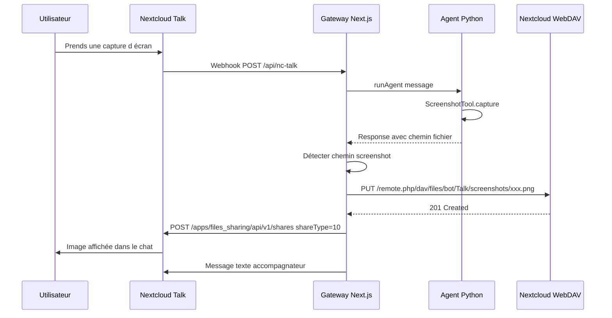

# Plan : Affichage des Screenshots dans Nextcloud Talk

## Problème

Actuellement, lorsqu'un utilisateur demande une capture d'écran via le bot Nextcloud Talk, l'agent retourne uniquement le chemin du fichier sauvegardé localement :

```
📸 Capture d'écran prise avec succès !
Le fichier a été sauvegardé à cet emplacement :
C:\tmp\myclawshots\screen_20260319_150922.png
```

L'utilisateur doit ouvrir le fichier manuellement - l'image n'est pas visible dans le chat.

## Analyse des APIs Nextcloud Talk

### API Bot - Limitations
L'API Bot (`/bot/{token}/message`) permet uniquement d'envoyer des **messages texte**. Il n'existe pas d'endpoint pour envoyer des fichiers directement via l'API Bot.

### API de Partage de Fichiers
Pour afficher une image dans un chat Nextcloud Talk, il faut utiliser l'API `files_sharing` :

```
POST /ocs/v2.php/apps/files_sharing/api/v1/shares
```

| Paramètre | Valeur | Description |
|-----------|--------|-------------|
| `shareType` | `10` | Partage vers une conversation |
| `shareWith` | `token` | Token de la conversation |
| `path` | `/Talk/bot-screenshots/xxx.png` | Chemin du fichier dans Nextcloud |

### Prérequis
- **Compte utilisateur Nextcloud** dédié au bot (avec credentials)
- **WebDAV** pour uploader le fichier vers Nextcloud
- **API OCS** pour partager le fichier dans la conversation

## Solution Proposée

### Architecture



### Flux de Traitement

1. **Capture** : L'agent Python prend le screenshot et retourne le chemin local
2. **Détection** : La gateway détecte qu'un screenshot a été généré (pattern `C:\tmp\myclawshots\*.png`)
3. **Upload WebDAV** : Le fichier est uploadé vers Nextcloud via WebDAV
4. **Partage** : Le fichier est partagé dans la conversation via l'API `files_sharing`
5. **Message** : Un message texte accompagne l'image

## Modifications Nécessaires

### 1. Configuration - Variables d Environnement

Fichier : `gateway/.env.local`

```bash
# Nextcloud Talk Bot - Existant
NC_TALK_BASE_URL="https://your-nextcloud.example.com"
NC_TALK_BOT_SECRET="votre_secret"

# NOUVEAU : Compte utilisateur pour upload WebDAV
NC_BOT_USERNAME="my-claw-bot"
NC_BOT_PASSWORD="app-password-generated"
```

### 2. Nouveau Module - nc-upload.ts

Fichier : `gateway/lib/nc-upload.ts`

```typescript
// Fonctions à implémenter :
// - uploadFileViaWebDAV(filePath: string, remotePath: string): Promise<string>
// - shareFileToConversation(fileId: string, conversationToken: string): Promise<void>
```

### 3. Modification - nc-talk/route.ts

Modifier le traitement de la réponse de l'agent :

```typescript
// Après réception de la réponse de l'agent
const response = await runAgent(messageText, history, model);

// Détecter si la réponse contient un chemin de screenshot
const screenshotPath = extractScreenshotPath(response);

if (screenshotPath) {
  // Upload vers Nextcloud
  const remotePath = await uploadScreenshot(screenshotPath);
  
  // Partager dans la conversation
  await shareFileToConversation(remotePath, conversationToken);
  
  // Message accompagnateur (sans le chemin local)
  const userMessage = "📸 Capture d'écran prise !";
  await sendNCMessage(conversationToken, userMessage, messageId);
} else {
  // Message normal
  await sendNCMessage(conversationToken, response, messageId);
}
```

### 4. Pattern de Détection

Expression régulière pour détecter les chemins de screenshot :

```typescript
const SCREENSHOT_PATTERN = /[A-Z]:\\tmp\\myclawshots\\screen_\d{8}_\d{6}\.png/g;
```

## Alternatives Considérées

### Alternative 1 : URL Publique via Gateway
- Servir les screenshots via un endpoint HTTP de la gateway
- Nécessite une URL publique (ngrok, cloudflare tunnel)
- L'image ne s'affiche pas directement (juste un lien)

### Alternative 2 : Base64 dans le Message
- Non supporté par Nextcloud Talk
- Limite de taille des messages

## Prérequis d Infrastructure

1. **Compte Nextcloud dédié** au bot avec :
   - Droits d'écriture dans un dossier `/Talk/bot-screenshots/`
   - App-password générée pour l'authentification

2. **Création du dossier** sur le Nextcloud :
   ```
   /Talk/bot-screenshots/
   ```

## Guide : Créer et Configurer le Compte Bot Nextcloud

### Étape 1 : Créer l Utilisateur Nextcloud

Connectez-vous à votre Nextcloud en tant qu'administrateur :

1. Allez dans **Paramètres** → **Utilisateurs**
2. Cliquez sur **Nouvel utilisateur**
3. Remplissez :
   - **Nom d'utilisateur** : `my-claw-bot`
   - **Mot de passe** : Générer un mot de passe fort
   - **Groupe** : Optionnel (peut être vide ou créer un groupe "bots")

### Étape 2 : Créer un Mot de Passe d Application

Le mot de passe d'application est nécessaire pour l'authentification WebDAV sans exposer le mot de passe principal.

1. Connectez-vous avec le compte `my-claw-bot`
2. Allez dans **Paramètres personnels** → **Sécurité**
3. Scrollez jusqu'à **Mots de passe d'application**
4. Cliquez sur **Créer un nouveau mot de passe d'application**
5. Donnez un nom : `my-claw-webdav`
6. **Copiez le mot de passe généré** (il ne sera plus affiché ensuite)

### Étape 3 : Créer le Dossier de Screenshots

1. Dans Nextcloud, allez dans **Fichiers**
2. Créez un dossier : `Talk`
3. Dans ce dossier, créez : `bot-screenshots`
4. Chemin final : `/Talk/bot-screenshots/`

### Étape 4 : Configurer les Variables d Environnement

Ajoutez dans `gateway/.env.local` :

```bash
# Compte Nextcloud pour upload WebDAV
NC_BOT_USERNAME="my-claw-bot"
NC_BOT_PASSWORD="le-mot-de-passe-d-application-copié"
```

### Étape 5 : Tester la Connexion WebDAV

Testez l'accès WebDAV depuis votre machine Windows :

```powershell
# Remplacez par vos valeurs
$nextcloudUrl = "https://your-nextcloud.example.com"
$username = "my-claw-bot"
$password = "votre-app-password"

# Test avec curl (si installé)
curl -u "${username}:${password}" "${nextcloudUrl}/remote.php/dav/files/${username}/"
```

Vous devriez recevoir une réponse XML listant les fichiers/dossiers.

---

## Checklist d Implémentation

- [x] Créer/configurer le compte Nextcloud pour le bot
- [x] Générer une app-password pour l'authentification WebDAV
- [x] Créer le dossier `/Talk/bot-screenshots/` sur Nextcloud
- [x] Ajouter les variables d'environnement dans `gateway/.env.local`
- [x] Implémenter `gateway/lib/nc-upload.ts`
- [x] Modifier `gateway/app/api/nc-talk/route.ts`
- [x] Tester le flux complet
- [x] Mettre à jour la documentation
