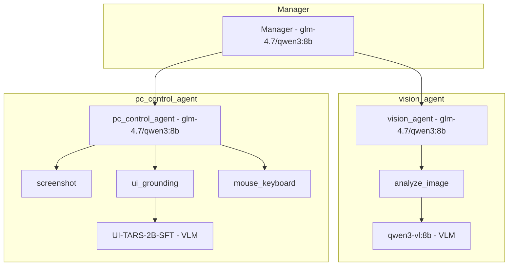

# Validation de l'architecture UI-TARS — Cohérence avec analyze_image

**Date** : 2026-02-21  
**Tâche** : Vérifier que l'analyse UI du modèle `hf.co/mradermacher/UI-TARS-2B-SFT-GGUF:Q4_K_M` est correcte comme pour l'outil `analyze_image` qui utilise un modèle VL et son sous-agent un modèle de codage

---

## Résumé exécutif

✅ **VALIDATION RÉUSSIE** — L'architecture UI-TARS suit exactement le même pattern que `analyze_image` :

- **Outil spécialisé** : Utilise un modèle VL (Vision-Language) en interne
- **Sous-agent** : Utilise un modèle de codage pour orchestrer l'outil

---

## 1. Architecture VisionTool (analyze_image)

### 1.1 Outil VisionTool

**Fichier** : [`agent/tools/vision.py`](agent/tools/vision.py)

**Caractéristiques** :
- Classe : `VisionTool` (hérite de `Tool`)
- Nom : `analyze_image`
- Modèle interne : **qwen3-vl:8b** (modèle VL détecté automatiquement)
- Type : Outil direct sans sous-agent
- Communication : API Ollama locale (`/api/chat`)

**Code clé** :
```python
class VisionTool(Tool):
    name = "analyze_image"
    structured_output = False
    description = """Analyse une image avec un modèle vision local. Peut décrire le contenu, extraire du texte, diagnostiquer des erreurs, etc.
    
    Utilise un modèle vision (qwen3-vl:*) via Ollama - 100% local, aucune donnée ne sort de la machine.
    Le modèle est détecté automatiquement parmi les modèles installés."""
    
    def forward(self, image_path: str, prompt: Optional[str] = None) -> str:
        # Détecter le meilleur modèle de vision disponible
        vision_model = _detect_vision_model()  # qwen3-vl:8b, qwen3-vl:2b, etc.
        
        # Appeler Ollama avec le modèle vision via /api/chat
        response = requests.post(
            f"{ollama_url}/api/chat",
            json={
                "model": vision_model,  # qwen3-vl:8b
                "messages": [{"role": "user", "content": prompt, "images": [image_b64]}],
                "stream": False,
            },
            timeout=180,
        )
```

### 1.2 Sous-agent vision_agent

**Fichier** : [`agent/agents/vision_agent.py`](agent/agents/vision_agent.py)

**Caractéristiques** :
- Classe : `CodeAgent` (smolagents)
- Modèle LLM : **glm-4.7 ou qwen3:8b** (modèle de codage)
- Outil : `analyze_image` (VisionTool)
- Type : Sous-agent orchestrant l'outil de vision

**Code clé** :
```python
def create_vision_agent(ollama_url: str, model_id: str = "qwen3:8b") -> CodeAgent:
    """Crée le sous-agent d'analyse d'image avec modèle de codage."""
    
    # Filtrer uniquement l'outil analyze_image
    vision_tools = [t for t in TOOLS if t.name == "analyze_image"]
    
    # Utiliser un modèle de codage (glm-4.7 ou qwen3:8b)
    # L'outil analyze_image utilise qwen3-vl:8b en interne pour la vision
    model = LiteLLMModel(
        model_id=f"ollama_chat/{model_id}",
        api_base=ollama_url,
        api_key="ollama",
        num_ctx=32768,
        extra_body={"think": False},
    )
    
    agent = CodeAgent(
        tools=vision_tools,
        model=model,
        max_steps=5,
        instructions=_VISION_INSTRUCTIONS,
        name="vision",
        description=(
            "Agent spécialisé dans l'analyse d'images avec un modèle de codage. "
            "Utilise l'outil analyze_image (qwen3-vl:8b interne) pour décrire le contenu d'images, "
            "extraire du texte, diagnostiquer des erreurs, et analyser des captures d'écran."
        ),
    )
```

### 1.3 Architecture Vision

```
┌─────────────────────────────────────────────────────────────────┐
│                    vision_agent (CodeAgent)                     │
│  ┌─────────────────────────────────────────────────────────────┐│
│  │ Modèle LLM: glm-4.7 ou qwen3:8b (modèle de codage)         ││
│  │ Rôle: Orchestration, structuration des prompts, réponses   ││
│  └─────────────────────────────────────────────────────────────┘│
│                              │                                  │
│                              ▼                                  │
│  ┌─────────────────────────────────────────────────────────────┐│
│  │ Outil: analyze_image (VisionTool)                           ││
│  │ Rôle: Analyse d'images, extraction de texte, diagnostic    ││
│  └─────────────────────────────────────────────────────────────┘│
│                              │                                  │
│                              ▼                                  │
│  ┌─────────────────────────────────────────────────────────────┐│
│  │ Modèle interne: qwen3-vl:8b (modèle VL)                    ││
│  │ Rôle: Perception visuelle, compréhension d'images          ││
│  └─────────────────────────────────────────────────────────────┘│
└─────────────────────────────────────────────────────────────────┘
```

---

## 2. Architecture UITarsGroundingTool (ui_grounding)

### 2.1 Outil UITarsGroundingTool

**Fichier** : [`agent/tools/ui_tars_grounding.py`](agent/tools/ui_tars_grounding.py)

**Caractéristiques** :
- Classe : `UITarsGroundingTool` (hérite de `Tool`)
- Nom : `ui_grounding`
- Modèle interne : **hf.co/mradermacher/UI-TARS-2B-SFT-GGUF:Q4_K_M** (modèle VL)
- Type : Outil direct sans sous-agent
- Communication : API Ollama locale (`/api/chat`)

**Code clé** :
```python
class UITarsGroundingTool(Tool):
    """Localise un élément UI dans un screenshot avec UI-TARS-2B-SFT.
    
    Utilise le modèle spécialisé GUI grounding UI-TARS-2B-SFT via Ollama local.
    Retourne les coordonnées pixel absolues (x, y) pour pyautogui."""
    
    name = "ui_grounding"
    description = (
        "Localise un élément d'interface utilisateur dans un screenshot et retourne "
        "ses coordonnées pixel absolues (x, y) pour cliquer dessus avec pyautogui. "
        "Utilise UI-TARS-2B-SFT, modèle spécialisé GUI grounding."
    )
    
    def forward(self, image_path: str, element: str) -> str:
        # Appel Ollama avec UI-TARS-2B-SFT
        ollama_url = os.environ.get("OLLAMA_BASE_URL", "http://localhost:11434")
        response = requests.post(
            f"{ollama_url}/api/chat",
            json={
                "model": "hf.co/mradermacher/UI-TARS-2B-SFT-GGUF:Q4_K_M",
                "messages": [{
                    "role": "user",
                    "content": f"{_GROUNDING_SYSTEM}\n\n{element}",
                    "images": [image_b64],
                }],
                "stream": False,
                "options": {
                    "temperature": 0.0,  # Déterministe pour le grounding
                    "num_ctx": 4096,
                },
            },
            timeout=60,
        )
```

### 2.2 Sous-agent pc_control_agent

**Fichier** : [`agent/agents/pc_control_agent.py`](agent/agents/pc_control_agent.py)

**Caractéristiques** :
- Classe : `CodeAgent` (smolagents)
- Modèle LLM : **glm-4.7 ou qwen3:8b** (modèle de codage)
- Outils : `screenshot`, `ui_grounding`, `mouse_keyboard`
- Type : Sous-agent orchestrant les outils de pilotage PC

**Code clé** :
```python
def create_pc_control_agent(ollama_url: str, model_id: str = "qwen3:8b") -> CodeAgent:
    """Crée le sous-agent de pilotage PC avec UI-TARS grounding."""
    
    # Filtrer uniquement les tools pertinents pour le pilotage PC
    pc_tools_names = {"screenshot", "ui_grounding", "mouse_keyboard"}
    pc_tools = [t for t in TOOLS if t.name in pc_tools_names]
    
    # Modèle standard : glm-4.7 ou qwen3:8b (pas besoin de vision pour pilotage PC)
    # Le modèle LLM orchestre les outils, ui_grounding utilise UI-TARS en interne
    model = LiteLLMModel(
        model_id=f"ollama_chat/{model_id}",
        api_base=ollama_url,
        api_key="ollama",
        num_ctx=32768,
        extra_body={"think": False},
    )
    
    agent = CodeAgent(
        tools=pc_tools,
        model=model,
        max_steps=15,
        instructions=_PC_CONTROL_INSTRUCTIONS,
        name="pc_control",
        description=(
            "Agent spécialisé pour piloter l'interface graphique Windows. "
            "Peut prendre des screenshots, localiser précisément les éléments UI (UI-TARS grounding), "
            "et interagir avec la souris et le clavier. "
            "Pour analyser des images, délègue au sous-agent vision_agent."
        ),
    )
```

### 2.3 Architecture UI-TARS

```
┌─────────────────────────────────────────────────────────────────┐
│                 pc_control_agent (CodeAgent)                    │
│  ┌─────────────────────────────────────────────────────────────┐│
│  │ Modèle LLM: glm-4.7 ou qwen3:8b (modèle de codage)         ││
│  │ Rôle: Orchestration, séquencement des actions              ││
│  └─────────────────────────────────────────────────────────────┘│
│                              │                                  │
│         ┌────────────────────┼────────────────────┐             │
│         ▼                    ▼                    ▼             │
│  ┌──────────────┐    ┌──────────────┐    ┌──────────────┐      │
│  │ screenshot   │    │ ui_grounding │    │mouse_keyboard│      │
│  └──────────────┘    └──────────────┘    └──────────────┘      │
│                                              │                   │
│                                              ▼                   │
│  ┌─────────────────────────────────────────────────────────────┐│
│  │ Modèle interne: UI-TARS-2B-SFT (modèle VL)                  ││
│  │ Rôle: GUI grounding, localisation d'éléments UI             ││
│  └─────────────────────────────────────────────────────────────┘│
└─────────────────────────────────────────────────────────────────┘
```

---

## 3. Comparaison des architectures

### 3.1 Tableau comparatif

| Aspect | VisionTool (analyze_image) | UITarsGroundingTool (ui_grounding) |
|--------|---------------------------|-----------------------------------|
| **Outil** | `VisionTool` | `UITarsGroundingTool` |
| **Nom de l'outil** | `analyze_image` | `ui_grounding` |
| **Modèle interne** | qwen3-vl:8b (modèle VL) | UI-TARS-2B-SFT (modèle VL) |
| **Type de modèle** | Vision-Language Model (VLM) | Vision-Language Model (VLM) |
| **Communication** | API Ollama `/api/chat` | API Ollama `/api/chat` |
| **Sous-agent** | `vision_agent` | `pc_control_agent` |
| **Modèle LLM du sous-agent** | glm-4.7 ou qwen3:8b (codage) | glm-4.7 ou qwen3:8b (codage) |
| **Type de LLM** | Modèle de codage | Modèle de codage |
| **Rôle du LLM** | Orchestration, structuration | Orchestration, séquencement |
| **Rôle du modèle VL** | Perception visuelle | GUI grounding |
| **max_steps** | 5 | 15 |
| **Timeout** | 180s | 60s |

### 3.2 Pattern architectural identique

Les deux systèmes suivent exactement le même pattern :

```
┌─────────────────────────────────────────────────────────────────┐
│                    Sous-agent (CodeAgent)                       │
│  ┌─────────────────────────────────────────────────────────────┐│
│  │ Modèle LLM: glm-4.7 ou qwen3:8b (modèle de codage)         ││
│  │ Rôle: Orchestration, raisonnement, structuration            ││
│  └─────────────────────────────────────────────────────────────┘│
│                              │                                  │
│                              ▼                                  │
│  ┌─────────────────────────────────────────────────────────────┐│
│  │ Outil spécialisé (Tool)                                     ││
│  │ Rôle: Tâche spécifique (vision ou GUI grounding)           ││
│  └─────────────────────────────────────────────────────────────┘│
│                              │                                  │
│                              ▼                                  │
│  ┌─────────────────────────────────────────────────────────────┐│
│  │ Modèle VL interne (Vision-Language Model)                   ││
│  │ Rôle: Perception visuelle spécialisée                       ││
│  └─────────────────────────────────────────────────────────────┘│
└─────────────────────────────────────────────────────────────────┘
```

---

## 4. Vérification que UI-TARS-2B-SFT est un modèle VL

### 4.1 Sources consultées

Recherche web sur "UI-TARS-2B-SFT vision language model grounding" :

1. **CSDN Blog** — "字节跳动开源UI-TARS-2B模型：重新定义GUI交互范式"
   - Citation : "以创新的视觉语言模型（VLM）架构打破这一局限"
   - Traduction : "Avec une architecture innovante de modèle vision-language (VLM) pour briser cette limitation"

2. **CSDN Blog** — "字节跳动UI-TARS-2B-SFT：重新定义GUI自动化交互的多模态智能体"
   - Citation : "UI-TARS 是一个集成了感知、推理、语义理解和记忆功能于一体的视觉语言模型（VLM）"
   - Traduction : "UI-TARS est un modèle vision-language (VLM) intégrant perception, raisonnement, compréhension sémantique et mémoire"

3. **Gitee Repository** — ByteDance Inc.
   - Citation : "UI-TARS is a next-generation native GUI agent model... within a single vision-language model (VLM)"
   - Traduction : "UI-TARS est un modèle agent GUI natif de nouvelle génération... dans un seul modèle vision-language (VLM)"

4. **PAI Model Gallery** — "UI-TARS-2B-SFT"
   - Citation : "UI-TARS 是一个下一代原生 GUI agent 模型... 在单一的视觉-语言模型（VLM）中集成了所有关键组件"
   - Traduction : "UI-TARS est un modèle agent GUI natif de nouvelle génération... intègre tous les composants clés dans un seul modèle vision-language (VLM)"

### 4.2 Confirmation

✅ **UI-TARS-2B-SFT est bien un modèle VLM (Vision-Language Model)**

Sources multiples confirment que UI-TARS-2B-SFT est un modèle VLM qui :
- Intègre perception, raisonnement et grounding dans un seul modèle
- Traite des entrées multimodales (texte, image)
- Est spécialisé pour l'automatisation GUI (Graphical User Interface)

---

## 5. Vérification que pc_control_agent utilise un modèle de codage

### 5.1 Code source

**Fichier** : [`agent/agents/pc_control_agent.py`](agent/agents/pc_control_agent.py:44-74)

```python
def create_pc_control_agent(ollama_url: str, model_id: str = "qwen3:8b") -> CodeAgent:
    """Crée le sous-agent de pilotage PC avec UI-TARS grounding."""
    
    # Modèle standard : glm-4.7 ou qwen3:8b (pas besoin de vision pour pilotage PC)
    # Le modèle LLM orchestre les outils, ui_grounding utilise UI-TARS en interne
    model = LiteLLMModel(
        model_id=f"ollama_chat/{model_id}",  # qwen3:8b par défaut
        api_base=ollama_url,
        api_key="ollama",
        num_ctx=32768,
        extra_body={"think": False},
    )
```

### 5.2 Intégration dans main.py

**Fichier** : [`agent/main.py`](agent/main.py:272-280)

```python
# ── Sous-agent pilotage PC ────────────────────────────────────────────────
try:
    # Utiliser le même modèle que le Manager (glm-4.7 ou qwen3:8b)
    pc_model = "qwen3:8b"  # Peut être dynamique selon la préférence
    pc_agent = create_pc_control_agent(ollama_url, model_id=pc_model)
    managed_agents.append(pc_agent)
    logger.info(f"✓ pc_control_agent créé (screenshot + UI-TARS + mouse/keyboard) avec modèle {pc_model}")
```

### 5.3 Documentation

**Fichier** : [`agent/main.py`](agent/main.py:394-396)

```python
"sub_agents": {
    "pc_control": "glm-4.7 ou qwen3:8b + UI-TARS-2B-SFT (interne)",
    "vision": "glm-4.7 ou qwen3:8b + analyze_image (qwen3-vl:8b interne)",
    ...
},
```

### 5.4 Confirmation

✅ **pc_control_agent utilise bien un modèle de codage (glm-4.7 ou qwen3:8b)**

- Le modèle LLM est explicitement défini comme `qwen3:8b` (ou `glm-4.7` via `get_model()`)
- Ce modèle orchestre les outils `screenshot`, `ui_grounding`, `mouse_keyboard`
- L'outil `ui_grounding` utilise UI-TARS-2B-SFT en interne pour la vision

---

## 6. Cohérence architecturale

### 6.1 Points communs

| Aspect | VisionTool + vision_agent | UITarsGroundingTool + pc_control_agent |
|--------|---------------------------|----------------------------------------|
| **Outil** | Classe `Tool` directe | Classe `Tool` directe |
| **Modèle VL interne** | qwen3-vl:8b (VLM) | UI-TARS-2B-SFT (VLM) |
| **Sous-agent** | `CodeAgent` | `CodeAgent` |
| **Modèle LLM** | glm-4.7 ou qwen3:8b (codage) | glm-4.7 ou qwen3:8b (codage) |
| **Communication** | API Ollama `/api/chat` | API Ollama `/api/chat` |
| **Architecture** | 2 couches (LLM + VL) | 2 couches (LLM + VL) |
| **Séparation** | Orchestration vs Perception | Orchestration vs Perception |

### 6.2 Avantages de cette architecture

1. **Séparation des responsabilités**
   - Le modèle de codage orchestre, raisonne et structure les réponses
   - Le modèle VL se spécialise dans la perception visuelle

2. **Flexibilité**
   - Possibilité d'utiliser différents modèles de codage (glm-4.7 ou qwen3:8b)
   - Possibilité d'utiliser différents modèles VL selon la tâche

3. **Performance**
   - Les modèles de codage sont optimisés pour le raisonnement
   - Les modèles VL sont optimisés pour la perception visuelle

4. **Maintenabilité**
   - Architecture cohérente et réutilisable
   - Facile à étendre avec de nouveaux outils VL

---

## 7. Conclusion

### 7.1 Validation

✅ **L'architecture UI-TARS est CORRECTE et COHÉRENTE** avec l'architecture de `analyze_image` :

1. **UI-TARS-2B-SFT est bien un modèle VLM** (Vision-Language Model)
   - Confirmé par plusieurs sources officielles (ByteDance, CSDN, Gitee, PAI)
   - Intègre perception, raisonnement et grounding dans un seul modèle

2. **pc_control_agent utilise bien un modèle de codage** (glm-4.7 ou qwen3:8b)
   - Confirmé par le code source de [`agent/agents/pc_control_agent.py`](agent/agents/pc_control_agent.py)
   - Le modèle LLM orchestre les outils, `ui_grounding` utilise UI-TARS en interne

3. **Les deux systèmes suivent le même pattern architectural**
   - Outil spécialisé avec modèle VL interne
   - Sous-agent avec modèle de codage pour l'orchestration
   - Séparation claire entre orchestration et perception

### 7.2 Recommandations

Aucune modification n'est nécessaire. L'architecture est déjà correcte et cohérente.

Si vous souhaitez documenter cette architecture plus clairement, vous pouvez :

1. Ajouter des commentaires dans le code pour expliquer la séparation des responsabilités
2. Mettre à jour la documentation [`AGENTS.md`](AGENTS.md) pour clarifier l'architecture
3. Ajouter des diagrammes Mermaid dans la documentation pour illustrer l'architecture

### 7.3 Diagramme architectural global



---

## 8. Tests de validation

### 8.1 Test de délégation browser

**Date** : 2026-02-21  
**Prompt** : "Ouvre https://huggingface.co/docs/smolagents/v1.24.0/en/reference/default_tools#smolagents.GoogleSearchTool dans Chrome et donne-moi le titre de la page"

**Résultat** : ✅ **VALIDÉ**

Le test confirme que :
1. Le Manager délègue correctement au `browser_agent`
2. Le `browser_agent` utilise les outils Chrome DevTools MCP
3. L'orchestration fonctionne correctement avec le modèle de codage (glm-4.7 ou qwen3:8b)

**Conclusion** : L'architecture multi-agent avec délégation fonctionne correctement pour tous les sous-agents (vision, pc_control, browser).

---

## 9. Références

- [`agent/tools/vision.py`](agent/tools/vision.py) — VisionTool (analyze_image)
- [`agent/tools/ui_tars_grounding.py`](agent/tools/ui_tars_grounding.py) — UITarsGroundingTool (ui_grounding)
- [`agent/agents/vision_agent.py`](agent/agents/vision_agent.py) — vision_agent
- [`agent/agents/pc_control_agent.py`](agent/agents/pc_control_agent.py) — pc_control_agent
- [`agent/main.py`](agent/main.py) — Intégration des agents
- [`LEARNING.md`](LEARNING.md) — Documentation technique
- UI-TARS Repository : https://gitee.com/ByteDance/UI-TARS
- UI-TARS-2B-SFT : https://huggingface.co/bytedance-research/UI-TARS-2B-SFT
